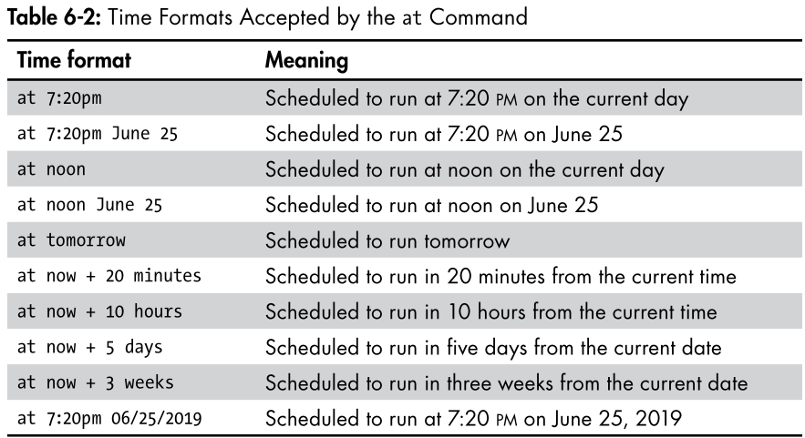

## What’s in This Book

This book aim to get u comfortable with using linux command specially for hackers, it will cover the following topics:
- Chapter 1: Getting Started with the Basics
- Chapter 2: Text Manipulation
- Chapter 3: Analyzing and Managing Networks
- Chapter 4: Adding and Removing Software
- Chapter 5: Controlling File and Directory Permissions
- Chapter 6: Process Management
- Chapter 7: Managing User Environment Variables
- Chapter 8: Bash Scripting
- Chapter 9: Compressing and Archiving
- Chapter 10: Filesystem and Storage Device Management
- Chapter 11: The Logging System
- Chapter 12: Using and Abusing Services
- Chapter 13: Becoming Secure and Anonymous
- Chapter 14: Understanding and Inspecting Wireless Networks
- Chapter 15: Managing the Linux Kernel and Loadable Kernel Modules
- Chapter 16: Automating Tasks with Job Scheduling
- Chapter 17: Python Scripting Basics for Hackers

# Chapter 1: Getting Started with the Basics
## Introductory Terms and Concepts
- **Kernel**: The core of the operating system that manages the hardware and software resources.
- **Shell**: The interface that allows you to interact with the operating system.
- **Terminal**: The text-based interface that allows you to interact with the shell.
- **Command**: An instruction given to the shell to perform a specific task.
- **Filesystem**: The structure used to organize and store files on a storage device.
- **Directory**: A container for files and other directories.
- **Path**: The location of a file or directory in the filesystem.

## The Linux Filesystem


## Basic Commands in Linux
- **pwd**: Print the current working directory.
- **whoami**: Display the current user.
- **cd**: Change the current directory.
- **ls**: List the contents of a directory.
- **man**: Display the manual page for a command.

## Finding Stuff
- **locate**: Search for files and directories.
```bash
locate filename
```

- **whereis**: Locate the binary, source, and manual page files for a command.
```bash
whereis command
```

- **which**: returns the location of the binaries in the PATH variable
```bash
which command
```

- **find**: Search for files and directories based on various criteria.
```bash
find directory options expression
find / -type f -name filename
```

- **grep**: Search for patterns in files.
```bash
ps aux | grep apache2
```

## Modifying Files and Directories
- **cat**: The cat command followed by a filename will display the contents of that file, but to create a file, we follow the cat command with a redirect,
```bash
cat > filename
```

- **touch**: Create an empty file or update the access and modification times of a file.
```bash
touch filename
```

- **mkdir**: Create a new directory.
```bash
mkdir directoryname
```

- **cp**: This creates a duplicate of the file in the new location and leaves the old one in place.
```bash
cp source destination
```

- **mv**: can be used to move a file or directory to a new location or simply to give an existing file a new name.
```bash
mv source destination
mv filename newfilename
```

- **rm**: Remove files or directories.
```bash
rm filename
```

- **rmdir**: Remove empty directories.
```bash
rmdir directoryname
```
:::note
It’s important to note that rmdir will not remove a directory that is not empty
:::

# Chapter 2: Text Manipulation
## Viewing Files
- **cat**: Display the contents of a file.
```bash
cat filename
```

- **head**: Display the first few lines (by default 10 lines) of a file.
```bash
head filename
head -20 filename
```

- **tail**: Display the last few lines (by default 10 lines) of a file.
```bash
tail filename
tail -20 filename
```

- **nl**: Display the contents of a file with line numbers.
```bash
nl filename
```

## Filtering Text with grep


## Using sed to Find and Replace
- **sed**: Stream editor for filtering and transforming text.
```bash
sed 's/old/new/g' filename
```
:::note
g stand for global, it will replace all the occurences of the old string with the new string
:::

## Viewing Files with more and less
- **more**: Display the contents of a file one screen at a time.
```bash
more filename
```

- **less**: Display the contents of a file one screen at a time with backward and forward navigation.
```bash
less filename
```

# Chapter 3: Analyzing and Managing Networks
## Analyzing Networks with ifconfig
- **ifconfig**: Display and configure network interfaces.


## Checking Wireless Network Devices with iwconfig
- **iwconfig**: you can use the iwconfig command to gather crucial information for wireless hacking such as the adapter’s IP address, its MAC address, what mode it’s in, and more.


## Changing Your Network Information
### Changing Your IP Address
- **ifconfig**: To change your IP address, you can use the ifconfig command followed by the name of the interface you want to change, the IP address you want to assign, and the netmask.
```bash
ifconfig eth0 192.168.191.212
ifconfig eth0 192.168.181.115 netmask 255.255.0.0 broadcast 192.168.1.255
```
You can also change your network mask (netmask) and broadcast address
with the ifconfig command.

### Spoofing Your MAC Address
You can also use ifconfig to change your MAC address
```bash
ifconfig eth0 down
ifconfig eth0 hw ether 00:11:22:33:44:55
ifconfig eth0 up
```
:::note
hw stands for hardware and ether is short for Ethernet.
:::

### Assigning New IP Addresses from the DHCP Server
Linux has a Dynamic Host Configuration Protocol (DHCP) server that runs a daemon—a process that runs in the background—called dhcpd, or the dhcp daemon. The DHCP server assigns IP addresses to all the systems on the subnet and keeps log files of which IP address is allocated to which machine at any one time.

To request an IP address from DHCP, simply call the DHCP server with the command dhclient followed by the interface you want the address assigned to. Different Linux distributions use different DHCP clients, but Kali is built on Debian, which uses dhclient. Therefore, you can assign a new address like this:
```bash
dhclient eth0
```

## Manipulating the Domain Name System
DNS is a critical component of the internet, and although it’s designed to translate domain names to IP addresses, a hacker can use it to garner information on the target.

### Changing Your DNS Server
- **/etc/resolv.conf**: The file that contains the IP addresses of the DNS servers your system uses.
```bash
nano /etc/resolv.conf
echo "nameserver 8.8.8.8"> /etc/resolv.conf
```

:::note
If you’re using a DHCP address and the DHCP server provides a DNS setting, the DHCP server will replace the contents of the file when it renews the DHCP address.
:::

### Mapping Your Own IP Addresses
- **/etc/hosts**: The file that contains the IP addresses of the hosts on your network.
```bash
nano /etc/hosts
```

# Chapter 4: Adding and Removing Software
## Using apt to Handle Software
- **apt**: The Advanced Package Tool (APT) is a package management system that allows you to install, update, and remove software on your system.
```bash
apt-cache search keyword
apt update
apt upgrade
apt install package
apt remove package # purge if you want to remove the configuration files as well
apt autoremove
apt search package
```

## Adding Repositories to Your sources.list File
The servers that hold the software for particular distributions of Linux are known as repositories.
```bash
nano /etc/apt/sources.list
```


## Installing Software with git
some software is not available in the official repositories, and you need to install it manually. One way to do this is by using git, a version control system that allows you to clone repositories from github.
```bash
git clone repositoryUrl
```

# Chapter 5: Controlling File and Directory Permissions
## Different Types of Users
- **Root**: The superuser who has complete control over the system.
- **Regular User**: A user who has limited control over the system.
- **Group**: A collection of users who share the same permissions.
- **Other**: Everyone else who has access to the system.

## Granting Permissions
The three levels of permission are as follows
- **Read (r)**: This grants permission only to open and view a file.
- **Write (w)**: This allows users to view and edit a file.
- **Execute (x)**: This allows users to execute a file (but not necessarily view or edit it).

### Granting Ownership to an Individual User
- **chown**: Change the owner of a file or directory.
```bash
chown username filename
```
### Granting Ownership to a Group
- **chgrp**: Change the group ownership of a file or directory.
```bash
chgrp groupname filename
```

## Checking Permissions
- **ls -l**: –l (long) switch to display the contents of a directory in long format—this list will contain the permissions.


On each line, we get information about:
- The file type (d for directory, - for file)
- The permissions on the file for owner, groups, and users, respectively
- The number of links to the file
- The owner of the file
- The group that owns the file
- The size of the file
- The date and time the file was last modified
- The name of the file

## Changing Permissions
### Changing Permissions with Decimal Notation
- **chmod**: Change the permissions of a file or directory.
```bash
chmod permissions filename
```


### Changing Permissions with UGO

:::tip[UGO]
\- Removes a permission \
\+ Adds a permission \
= Sets a permission
:::

```bash
chmod u=rwx,g=rx,o=r filename
```

## Setting More Secure Default Permissions with Masks
- **umask**: is a three-digit octal number corresponding to the three permissions digits, but the umask number is subtracted from the permissions number to give the new permissions status. This means that when a new file or directory is created, its permissions are set to the default value minus the value in umask

```bash
umask 022
```


## Special Permissions
- **Set User ID (SUID)**: the SUID bit says that any user can execute the file with the permissions of the owner but those permissions don’t extend beyond the use of that file.
    - To set the SUID bit, enter a 4 before the regular permissions, so a file with a new resulting permission of 644 is represented as 4644 when the SUID bit is set.
- **Set Group ID (SGID)**: SGID also grants temporary elevated permissions, but it grants the permissions of the file owner’s group, rather than of the file’s owner. This means that, with an SGID bit set, someone without execute permission can execute a file if the owner belongs to the group that has permission to execute that file.
    - The SGID bit works slightly differently when applied to a directory: when the bit is set on a directory, ownership of new files created in that directory goes to the directory creator’s group, rather than the file creator’s group. This is very useful when a directory is shared by multiple users. All users in that group can execute the file(s), not just a single user.
    - The SGID bit is represented as 2 before the regular permissions, so a new file with the resulting permissions 644 would be represented as 2644 when the SGID bit is set. Again, you would use the chmod command for this—for example, chmod 2644 filename.

# Chapter 6: Process Management
once a hacker takes control of a target system, they might want to find and stop a certain process, like an antivirus application or firewall. To do so, the hacker would first need to know how to find the process.

## Viewing Processes
- **ps**: Display information about running processes.


:::tip[ps columns]
USER The user who invoked the process 
PID The process ID
%CPU The percent of CPU this process is using
%MEM The percent of memory this process is using
COMMAND The name of the command that started the process
:::

## Managing Processes
### Changing Process Priority with nice
- **nice**: you’re determining how “nice” you’ll be to other users: if your process is using most of the system resources, you aren’t being very nice.
```bash
nice -n 10 command
```
A high nice value translates to a low priority, and a low nice value translates to a high priority


When you start a process, you can set the priority level with the nice command and then alter the priority after the process has started run­ning with the renice command.

```bash
nice -n -10 /bin/slowprocess
renice 19 PID
```

### Killing Processes
- **kill**: Terminate a process.


### Running Processes in the Background
- **&**: Run a process in the background.
```bash
command &
```

### Moving a Process to the Foreground
- **fg**: Move a background process to the foreground.
```bash
fg PID
```

## Scheduling Processes
- **at**: is used to set up the daemon—a background process atd, which is useful for scheduling a job to run once at some point in the future



# Chapter 7: Managing User Environment Variables

