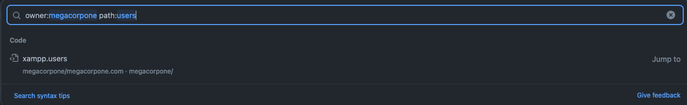

# 1. The Penetration Testing Lifecycle

A typical penetration test comprises the following stages:
- Defining the Scope
- Information Gathering
- Vulnerability Detection
- Initial Foothold
- Privilege Escalation
- Lateral Movement
- Reporting/Analysis
- Lessons Learned/Remediation

The scope of a penetration test engagement defines which IP ranges, hosts, and applications should be test subjects during the engagement, as compared to out-of-scope items that should not be tested.

:::Note
information gathering (also known as enumeration) does not end after our initial reconnaissance. We'll need to continue collecting data as the penetration test progresses, building our knowledge of the target's attack surface as we discover new information by gaining a foothold or moving laterally.
:::

# 2. Passive Information Gathering

The ultimate goal of passive information gathering is to obtain information that clarifies or expands an attack surface, helps us conduct a successful phishing campaign, or supplements other penetration testing steps

:::Note
Passive Information Gathering, also known as Open-source Intelligence (OSINT), is the process of collecting openly-available information about a target, generally without any direct interaction with that target.
:::

- **strictest interpretation** : we never communicate with the target directly.
- **looser interpretation** : we might interact with the target, but only as a normal internet user would.

## 2.1. Whois Enumeration

Whois is a TCP service, tool, and type of database that can provide information about a domain name, such as the name server and registrar. 

```bash
whois megacorpone.com
whois 38.100.193.70
```

## 2.2. Google Hacking
The site operator limits searches to a single domain. We can use this operator to gather a rough idea of an organization's web presence.
`site:megacorpone.com`

the filetype (or ext) operator limits search results to the specified file type.
`site:megacorpone.com filetype:txt`

The robots.txt file instructs web crawlers, such as Google's search engine crawler, to allow or disallow specific resources.
The ext operator could also be helpful to discern which programming languages might be used on a web site. Searches like ext:php, ext:xml, and ext:py will find indexed PHP Pages, XML, and Python pages, respectively.

We can also modify an operator using - to exclude particular items from a search, narrowing the results. `site:megacorpone.com -filtype:html`

we can use a search for intitle:"index of" "parent directory" to find pages that contain "index of" in the title and the words "parent directory" on the page.
`site:megacorpone.com intitle:"index of" "parent directory"`

:::Tip
[The Google Hacking Database (GHDB)](https://www.exploit-db.com/google-hacking-database) contains multitudes of creative searches that demonstrate the power of leveraging combined operators.

Another way of experimenting with Google Dorks is through the [DorkSearch](https://dorksearch.com/) portal, which provides a pre-built subset of queries and a builder tool to facilitate the search.
:::

## 2.3. Netcraft
[Netcraft](https://www.netcraft.com/) is an internet service company offering a free web portal that performs various information gathering functions such as discovering which technologies are running on a given website and finding which other hosts share the same IP netblock.

IPv4 autonomous systems	is a collection of IP address ranges that are under the control of a single organization.

## 2.4. Open-Source Code
This includes open-source projects and online code repositories such as:
- [GitHub](https://github.com/)
- [GitHub Gist](https://gist.github.com/)
- [GitLab](https://about.gitlab.com/)
- [SourceForge](https://sourceforge.net/)

:::Note
Code stored online can provide a glimpse into the programming languages and frameworks used by an organization. On a few rare occasions, developers have even accidentally committed sensitive data and credentials to public repos.
:::



This manual approach will work best on small repos. For larger repos, we can use several tools to help automate some of the searching, such as [Gitrob](https://github.com/michenriksen/gitrob) and [Gitleaks](https://github.com/zricethezav/gitleaks).. Most of these tools require an access token to use the source code-hosting provider's API.

:::Note
Tools that search through source code for secrets, like Gitrob or Gitleaks, generally rely on regular expressions or entropy-based detections to identify potentially useful information. Entropy-based detection attempts to find strings that are randomly generated. The idea is that a long string of random characters and numbers is probably a password. No matter how a tool searches for secrets, no tool is perfect and they will miss things that a manual inspection might find.
:::

## 2.5. Shodan
[Shodan](https://www.shodan.io/) is a search engine that crawls devices connected to the internet, including the servers that run websites, but also devices like routers and IoT devices.

To put it another way, Google and other search engines search for web server content, while Shodan searches for internet-connected devices, interacts with them, and displays information about them.

## 2.6. Security Headers and SSL/TLS
One such site, [Security Headers](https://securityheaders.com/), will analyze HTTP response headers and provide basic analysis of the target site's security posture. We can use this to get an idea of an organization's coding and security practices based on the results.


:::important
Server hardening is the overall process of securing a server via configuration. This includes processes such as disabling unneeded services, removing unused services or user accounts, rotating default passwords, setting appropriate server headers, and so forth.
:::

Another scanning tool we can use is the SSL Server Test from [Qualys SSL Labs](https://www.ssllabs.com/ssltest/). This tool analyzes a server's SSL/TLS configuration and compares it against current best practices. It will also identify some SSL/TLS related vulnerabilities, such as [Poodle](https://www.cisa.gov/news-events/alerts/2014/10/17/ssl-30-protocol-vulnerability-and-poodle-attack) or [Heartbleed](https://heartbleed.com/).


# 3. Active Information Gathering

:::important
When [Living off the Land](https://lolbas-project.github.io/), we can leverage several pre-installed and trusted Windows binaries to perform post-compromise analysis. These binaries are shortened as LOLBins or, more recently, LOLBAS to include Binaries, Scripts and Libraries.
:::

## 3.1. DNS Enumeration
The Domain Name System (DNS) is a distributed database responsible for translating user-friendly domain names into IP addresses.

Each domain can use different types of DNS records. Some of the most common types of DNS records include:
- NS: Nameserver records contain the name of the authoritative servers hosting the DNS records for a domain.
- A: Also known as a host record, the "a record" contains the IPv4 address of a hostname (such as www.megacorpone.com).
- AAAA: Also known as a quad A host record, the "aaaa record" contains the IPv6 address of a hostname (such as www.megacorpone.com).
- MX: Mail Exchange records contain the names of the servers responsible for handling email for the domain. A domain can contain multiple MX records.
- PTR: Pointer Records are used in reverse lookup zones and can find the records associated with an IP address.
- CNAME: Canonical Name Records are used to create aliases for other host records.
- TXT: Text records can contain any arbitrary data and be used for various purposes, such as domain ownership verification.

```bash
host www.megacorpone.com
host -t mx megacorpone.com
host -t txt megacorpone.com
for ip in $(cat list.txt); do host $ip.megacorpone.com; done
for ip in $(seq 200 254); do host 51.222.169.$ip; done | grep -v "not found"
```

DNSRecon is an advanced DNS enumeration script written in Python. Let's run dnsrecon against megacorpone.com, using the -d option to specify a domain name and -t to specify the type of enumeration to perform (in this case, a standard scan).

```bash
dnsrecon -d megacorpone.com -t std # std standard scan
dnsrecon -d megacorpone.com -D ~/list.txt -t brt # brt brute force
```

DNSEnum is another popular DNS enumeration tool that can be used to further automate DNS enumeration

```bash
dnsenum megacorpone.com
```

:::Tip
nslookup is another great utility for Windows DNS enumeration and still used during 'Living off the Land' scenarios.
```bash
nslookup mail.megacorpone.com
nslookup -type=TXT info.megacorpone.com 192.168.50.151
```
:::

## 3.2. TCP/UDP Port Scanning Theory
Port scanning is the process of inspecting TCP or UDP ports on a remote machine with the intention of detecting what services are running on the target and what potential attack vectors may exist.

:::Note
Netcat is not a port scanner, but it can be used as such in a rudimentary way to showcase how a typical port scanner works.
:::

The simplest TCP port scanning technique, usually called CONNECT scanning, relies on the three-way TCP handshake mechanism.

```bash
nc -nvv -w 1 -z 192.168.50.152 3388-3390
```

Let's run a UDP Netcat port scan against ports 120-123 on a different target. We'll use the only nc option we have not covered yet, -u, which indicates a UDP scan.

```bash
nc -nv -u -z -w 1 192.168.50.149 120-123
```

:::Note
UDP scanning can be problematic for several reasons. First, UDP scanning is often unreliable, as firewalls and routers may drop ICMP packets. This can lead to false positives and ports showing as open when they are, in fact, closed. Second, many port scanners do not scan all available ports, and usually have a pre-set list of "interesting ports" that are scanned. This means open UDP ports can go unnoticed. Using a protocol-specific UDP port scanner may help to obtain more accurate results. Finally, penetration testers often forget to scan for open UDP ports, instead focusing on the "more exciting" TCP ports. Although UDP scanning can be unreliable, there are plenty of attack vectors lurking behind open UDP ports. A TCP scan also generates much more traffic than a UDP scan, due to overhead and packet retransmissions.
:::

## 3.3. Port Scanning with Nmap

There are modern port scanners like [MASSCAN](https://tools.kali.org/information-gathering/masscan) and [RustScan](https://rustscan.github.io/RustScan/) that, although faster than Nmap, generate a substantial amount of concurrent traffic. Nmap, on the other hand, imposes some traffic rate limiting that results in less bandwidth congestion and more covert behavior.

## TCP Scanning
```bash
# Stealth / SYN Scanning
sudo nmap -sS 192.168.50.149
# TCP Connect Scanning : performs a full TCP connection.
sudo nmap -sT IP
```

:::important
Because the three-way handshake is never completed, the information is not passed to the application layer and as a result, will not appear in any application logs. A SYN scan is also faster and more efficient because fewer packets are sent and received.
:::

### UDP Scanning
```bash
sudo nmap -sU 192.168.50.149
```

The UDP scan (-sU) can also be used in conjunction with a TCP SYN scan (-sS) to build a more complete picture of our target.

```bash
sudo nmap -sU -sS 192.168.50.149
```

### Network Sweeping
we can attempt to probe targets using Network Sweeping techniques in which we begin with broad scans, then use more specific scans against hosts of interest. `-sn`

```bash
nmap -sn 192.168.50.1-253
nmap -v -sn 192.168.50.1-253 -oG ping-sweep.txt # oG is greppable output
grep Up ping-sweep.txt | cut -d " " -f 2 > live-hosts.txt
nmap -p 80 192.168.50.1-253 -oG web-sweep.txt
nmap -sT -A --top-ports=20 192.168.50.1-253 -oG top-port-sweep.txt
```

OS fingerprinting can be enabled with the -O option.

Nmap will inspect the traffic received from the target machine and attempt to match the fingerprint to a known list. By default, Nmap will display the detected OS only if the retrieved fingerprint is very accurate. we include the --osscan-guess option to force Nmap print the guessed result.

```bash
sudo nmap -O 192.168.50.14 --osscan-guess
```

If we want to run a plain service nmap scan we can do it by providing only the -sV parameter.

:::important
Banners can be modified by system administrators and intentionally set to fake service names to mislead potential attackers.
:::

:::TIP[Living off the Land]
The Test-NetConnection function checks if an IP responds to ICMP and whether a specified TCP port on the target host is open.
```bash
Test-NetConnection -Port 445 192.168.50.151
1..1024 | % {echo ((New-Object Net.Sockets.TcpClient).Connect("192.168.50.151", $_)) "TCP port $_ is open"} 2>$null
```
:::

## 3.4. SMB Enumeration
It should be noted that SMB (TCP port 445) and NetBIOS are two separate protocols.

```bash
nmap -v -p 139,445 -oG smb.txt 192.168.50.1-254
nmap -v -p 139,445 --script=smb-enum-*
```

There are other, more specialized tools for specifically identifying NetBIOS information, such as nbtscan.

```bash
sudo nbtscan -r 192.168.50.0/24
```

Nmap also offers many useful NSE scripts that we can use to discover and enumerate SMB services. We'll find these scripts in the /usr/share/nmap/scripts directory.

:::Note
The SMB discovery script works only if SMBv1 is enabled on the target, which is not the default case on modern versions of Windows. However, plenty of legacy systems are still running SMBv1
```bash
nmap -v -p 139,445 --script smb-os-discovery 192.168.50.152
```
:::

:::TIP[Living off the Land]
One useful tool for enumerating SMB shares within Windows environments is net view. It lists domains, resources, and computers belonging to a given host.
```bash
# we can list all the shares running on dc01.
net view \\dc01 /all
```
:::

## 3.5. SMTP Enumeration
The Simple Mail Transport Protocol (SMTP) supports several interesting commands, such as VRFY and EXPN. A VRFY request asks the server to verify an email address, while EXPN asks the server for the membership of a mailing list.

```bash
nc -nv 192.168.50.8 25
VRFY root
VRFY idontexist
```

## 3.6. SNMP Enumeration
SNMP is based on UDP, a simple, stateless protocol, and is therefore susceptible to IP spoofing and replay attacks. Additionally, the commonly used SNMP protocols 1, 2, and 2c offer no traffic encryption, meaning that SNMP information and credentials can be easily intercepted over a local network. Traditional SNMP protocols also have weak authentication schemes and are commonly left configured with default public and private community strings.

The SNMP Management Information Base (MIB) is a database containing information usually related to network management.

The [IBM Knowledge Center](https://www.ibm.com/support/knowledgecenter/ssw_aix_71/commprogramming/mib.html) contains a wealth of information about the MIB tree.

```bash
sudo nmap -sU --open -p 161 192.168.50.1-254 -oG open-snmp.txt

echo public > community
echo private >> community
echo manager >> community
for ip in $(seq 1 254); do echo 192.168.50.$ip; done > ips
onesixtyone -c community -i ips

snmpwalk -c public -v1 -t 10 192.168.50.151 # This command enumerates the entire MIB tree using the -c option to specify the community string, and -v to specify the SNMP version number as well as the -t 10 option to increase the timeout period to 10 seconds:
```

# 4. Wrapping Up
In this section, we covered the first stage of the penetration testing lifecycle: information gathering. We discussed passive and active information gathering techniques, including whois enumeration, Google hacking, Netcraft, open-source code, Shodan, security headers, SSL/TLS, DNS enumeration, TCP/UDP port scanning theory, port scanning with Nmap, network sweeping, SMB enumeration, SMTP enumeration, and SNMP enumeration.
