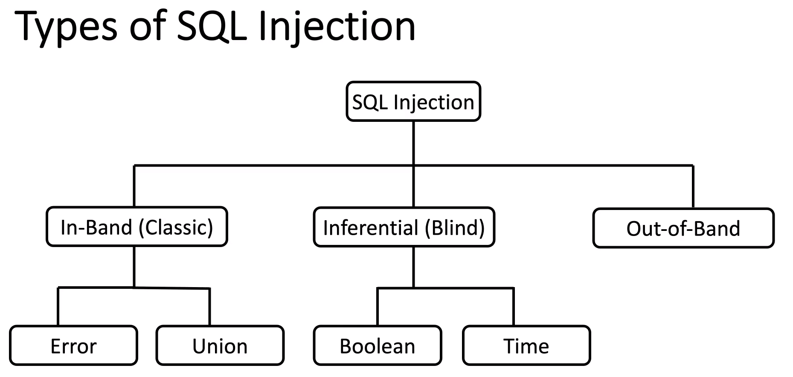

# SQL Injection

# Types of SQL Injection

# Blacl-Box Tesing Perspective

- Map the application
- Fuzz the application
    - Submit SQL-specific characters such as ' or ", and look for errors or other anomalies
• Submit Boolean conditions such as OR 1=1 and OR 1=2,
and look for differences in the application's responses
• Submit payloads designed to trigger time delays when
executed within a SQL query, and look for differences in
the time taken to respond
• Submit OAST payloads designed to trigger an out-of-band
network interaction when executed within an SQL query,
and monitor for any resulting interactions